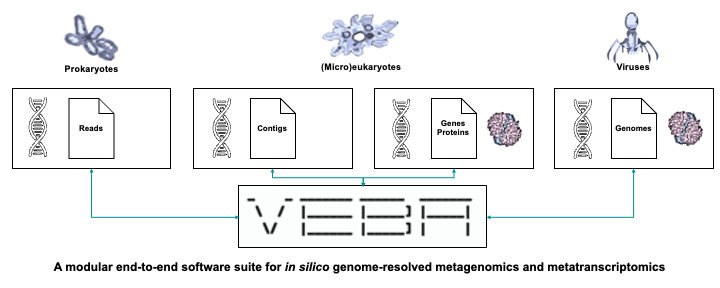

<a name="readme-top"></a>

  

[![Forks][forks-shield]][forks-url]
[![Stargazers][stars-shield]][stars-url]
[![Issues][issues-shield]][issues-url]


[forks-shield]: https://img.shields.io/github/forks/jolespin/veba.svg?style=for-the-badge
[forks-url]: https://github.com/jolespin/veba/members
[stars-shield]: https://img.shields.io/github/stars/jolespin/veba.svg?style=for-the-badge
[stars-url]: https://github.com/jolespin/veba/stargazers
[issues-shield]: https://img.shields.io/github/issues/jolespin/veba.svg?style=for-the-badge
[issues-url]: https://github.com/jolespin/veba/issues

[](images/graphical-abstract.pdf)

### What is VEBA? 
The *Viral Eukaryotic Bacterial Archaeal* (VEBA) open-source software suite was developed with characterizing all domains of microorganisms as the primary objective (not post hoc adjustments) including prokaryotic, eukaryotic, and viral organisms.  VEBA is an end-to-end metagenomics and bioprospecting software suite that can directly recover and analyze eukaryotic and viral genomes in addition to prokaryotic genomes with native support for candidate phyla radiation (CPR). VEBA implements a novel iterative binning procedure and an optional hybrid sample-specific/multi-sample framework that recovers more genomes than non-iterative methods.  To optimize the microeukaryotic gene calling and taxonomic classifications, VEBA includes a consensus microeukaryotic database containing protists and fungi compiled from several existing databases. VEBA also provides a unique clustering-based dereplication strategy allowing for sample-specific genomes and proteins to be directly compared across non-overlapping biological samples. VEBA also automates biosynthetic gene cluster identification and novelty scores for bioprospecting.

VEBA's mission is to make robust (meta-)genomics/transcriptomics analysis effortless.  The philosophy of VEBA is that workflows should be modular, generalizable, and easy-to-use with minimal intermediate steps.  The approach implemented in VEBA is to (try and) think 2 steps ahead of what you may need to do and automate the task for you.

<p align="right"><a href="#readme-top">^__^</a></p>

___________________________________________________________________

### Citation

* Espinoza JL, Phillips A, Prentice MB, Tan GS, Kamath PL, Lloyd KG, Dupont CL. Unveiling the microbial realm with VEBA 2.0: a modular bioinformatics suite for end-to-end genome-resolved prokaryotic, (micro)eukaryotic and viral multi-omics from either short- or long-read sequencing. Nucleic Acids Res. 2024 Jun 22:gkae528. [doi: 10.1093/nar/gkae528](https://doi.org/10.1093/nar/gkae528). PMID: 38909293.
* Espinoza JL, Dupont CL. VEBA: a modular end-to-end suite for in silico recovery, clustering, and analysis of prokaryotic, microeukaryotic, and viral genomes from metagenomes. BMC Bioinformatics. 2022 Oct 12;23(1):419. [doi: 10.1186/s12859-022-04973-8](https://doi.org/10.1186/s12859-022-04973-8). PMID: 36224545.

In addition to the above, please cite the software dependencies described under the [*Dependency Citation Table*](CITATIONS.md).

<p align="right"><a href="#readme-top">^__^</a></p>

___________________________________________________________________

### Tell developers what you do and what you need

The objective of VEBA is to provide high-quality metagenomics and metatranscriptomics workflows to the community.  Understanding the user-base's needs will help me develop VEBA so it can make your research life easier.  

Your insight matters, if you have 30 seconds to spare please fill out [this quick 5 question Google Form](https://forms.gle/AVVsY35ZrfS3jgVL7) (no e-mail needed). 

<p align="right"><a href="#readme-top">^__^</a></p>

___________________________________________________________________

### Announcements

* **Current Stable Version:** [`v2.2.0`](https://github.com/jolespin/veba/releases/tag/v2.2.0)

* **Current Database Version:** [`VDB_v7`](install/DATABASE.md)

	If you are updating to v2.2.0 you will need to modify your existing database.  
	Please see [FAQs](FAQ.md#how-can-i-update-the-database-from-veba-v210-veba-database-vdb_v6-to-veba-v220-veba-database-vdb_v7) for more details.

	<details>
		<summary>New features and updates:</summary>

	* **`VEBA` Modules:**
		* Expanded functionality, streamlined user-interface, and Docker containerization
		* Fast and memory-efficient genome- and protein-level clustering
		* Automatic calculation of feature compression ratios
		* Large/complex metagenomes and long-read technology support
		* Bioprospecting and natural product discovery support
		* Ribosomal RNA, transfer RNA, and organelle support
		* Genome-resolved taxonomic and pathway profiling
		* Identification and classification of mobile genetic elements
		* Native support for candidate phyla radiation quality assessment and memory- efficient genome classification
		* Standalone support for generalized multi-split binning
		* Automated phylogenomic functional category feature engineering support
		* Visualizations of hierarchical data and phylogenies
		* Added minimum alignment fraction threshold for genome clustering
		* Faster HMM protein annotations with PyHMMER

	* **`VEBA` Database (`VDB_v7`)**:

		* Completely rebuilt `VEBA's Microeukaryotic Protein Database` to produce a clustered database `MicroEuk100/90/50` similar to `UniRef100/90/50`. Available on [doi:10.5281/zenodo.10139450](https://zenodo.org/records/10139451).
		* Expanded protein annotation database
		* Updated `GTDB r214.1` to `GTDB r220`

	</details>


<p align="right"><a href="#readme-top">^__^</a></p>


___________________________________________________________________

### Getting started with *VEBA*


[*Installation and Database Configuration Guide*](install/README.md) for software installation and database configuration.

[*Usage and Resource Requirements Guide*](bin/README.md) for parameters and module descriptions

[*Walkthrough Guides*](walkthroughs/README.md) for tutorials and workflows on how to use VEBA

[*Visual Guides*](https://www.youtube.com/@VEBA-Multiomics) for video walkthroughs on how to use VEBA

[*Quick Guides*](walkthroughs/docs/interpreting_module_outputs.md) for interpreting module outputs.

[*Test Data*](data/README.md) for testing installation/methods.


**Usage Example:**

e.g., Running `preprocess` module. 

1) Syntax compatible with Conda:

```
source activate VEBA
veba --module preprocess --params "{PARAMS}" 
```

2) Syntax compatible with Conda and Docker/Singularity containers:

```
source activate VEBA-preprocess_env
preprocess.py "{PARAMS}"
```

Check out the [*VEBA* Change Log](CHANGELOG.md) for details between each update and insight into what is being implemented in the upcoming version.

<p align="right"><a href="#readme-top">^__^</a></p>

___________________________________________________________________


### Output structure
*VEBA*'s is built on the [*GenoPype*](https://github.com/jolespin/genopype) archituecture which creates a reproducible and easy-to-navigate directory structure.  *GenoPype*'s philosophy is to use the same names for all files but to have sample names as subdirectories.  This makes it easier to glob files for grepping, concatenating, etc. *NextFlow* support is in the works...

<details>
	<summary> Example of GenoPype layout: </summary>

```
# Project directory
project_directory/

# Temporary directory
project_directory/tmp/

# Log directory
project_directory/logs/
project_directory/logs/[step]__[program-name].e
project_directory/logs/[step]__[program-name].o
project_directory/logs/[step]__[program-name].returncode

# Checkpoint directory
project_directory/checkpoints/
project_directory/checkpoints/

# Intermediate directories for each step
project_directory/intermediate/
project_directory/intermediate/[step]__[program-name]/

# Output directory
project_directory/output/

# Commands
project_directory/commands.sh
```

For *VEBA*, it has all the directories created by `GenoPype` above but is built for having multiple samples under the same project. 

Example of *VEBA*'s default directory layout:

```
ID="sample_1"

# Main output directory
veba_output/

# Assembly directory
veba_output/assembly

# Assembly output for ${ID} sample
veba_output/assembly/${ID}/output/

# Prokaryotic binning for ${ID} sample
veba_output/binning/prokaryotic/${ID}/output/ 

# Eukaryotic binning
veba_output/binning/eukaryotic/${ID}/output/

# Viral binning
veba_output/binning/viral/${ID}/output/
```

The above are default output locations but they can be customized.

</details>

<p align="right"><a href="#readme-top">^__^</a></p>

___________________________________________________________________

### Frequently Asked Questions

If perusing the [*Frequently Asked Questions*](FAQ.md) doesn't address your question, feel free to submit a [[`Question`]](https://github.com/jolespin/veba/issues/new) 

<p align="right"><a href="#readme-top">^__^</a></p>

___________________________________________________________________

