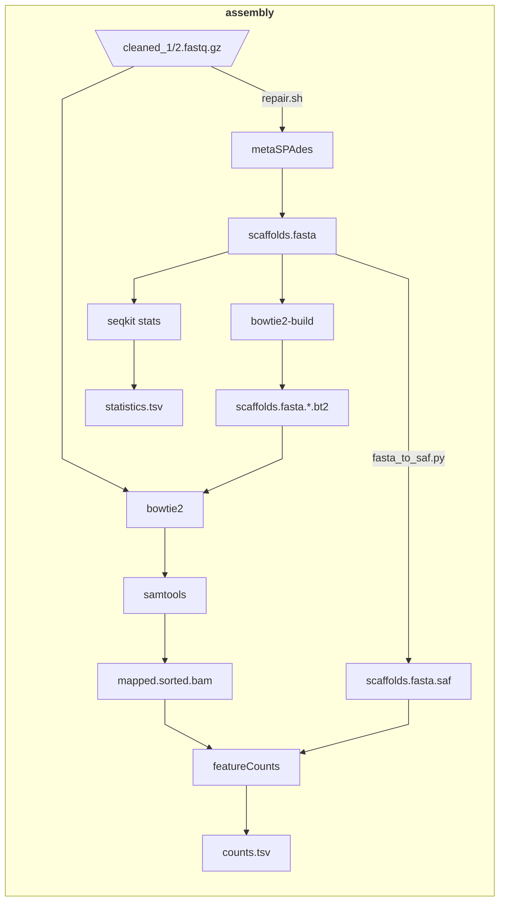

```mermaid
%%{init: { "flowchart": { "curve": "linear" } } }%%

%% Available curve styles include basis, bumpX, bumpY, cardinal, catmullRom, linear, monotoneX, monotoneY, natural, step, stepAfter, and stepBefore. %%%

graph LR

subgraph "`**assembly**`"

	%% Programs
	METASPADES["metaSPAdes"]
	SAMTOOLS["samtools"]
	BOWTIE2_INDEX["bowtie2-build"]
	BOWTIE2["bowtie2"]
	FEATURECOUNTS["featureCounts"]
	SEQKIT["seqkit stats"]

	%% inputs
	READS[\"cleaned_1/2.fastq.gz"/]

	%% outputs
	STATS["statistics.tsv"]
		
	%% FastP
	READS --repair.sh--> METASPADES
	METASPADES --> ASSEMBLY["scaffolds.fasta"]
	ASSEMBLY --"fasta_to_saf.py"--> SAF["scaffolds.fasta.saf"]

	%% Bowtie2
	ASSEMBLY --> BOWTIE2_INDEX --> INDEX["scaffolds.fasta.*.bt2"]

	READS & INDEX -->  BOWTIE2 --> SAMTOOLS --> BAM["mapped.sorted.bam"]

	%% featureCounts
	BAM & SAF --> FEATURECOUNTS --> COUNTS["counts.tsv"]

	ASSEMBLY --> SEQKIT --> STATS

end


```