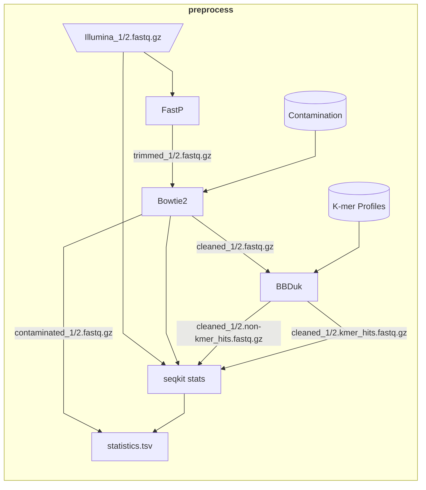

```mermaid
%%{init: { "flowchart": { "curve": "linear" } } }%%

%% Available curve styles include basis, bumpX, bumpY, cardinal, catmullRom, linear, monotoneX, monotoneY, natural, step, stepAfter, and stepBefore. %%%

graph LR

subgraph "`**preprocess**`"

	%% Programs
	FASTP["FastP"]
	BOWTIE2["Bowtie2"]
	SEQKIT["seqkit stats"]
	BBDUK["BBDuk"]

	%% Databases
	CONTAMINATION[("Contamination")]
	KMERS[("K-mer Profiles")]

	%% inputs
	READS[\"Illumina_1/2.fastq.gz"/]

	%% outputs
	STATS["statistics.tsv"]
		
	%% FastP
	READS --> FASTP

	FASTP --"trimmed_1/2.fastq.gz"--> BOWTIE2

	%% Bowtie2
	CONTAMINATION --> BOWTIE2
	BOWTIE2 --"cleaned_1/2.fastq.gz"--> BBDUK
	BOWTIE2 --"contaminated_1/2.fastq.gz"--> STATS

	%%BBDuk	
	KMERS --> BBDUK

	READS --> SEQKIT
	BOWTIE2 --> SEQKIT
	BBDUK --"cleaned_1/2.non-kmer_hits.fastq.gz"--> SEQKIT
	BBDUK --"cleaned_1/2.kmer_hits.fastq.gz"--> SEQKIT

	SEQKIT --> STATS


	
end


```