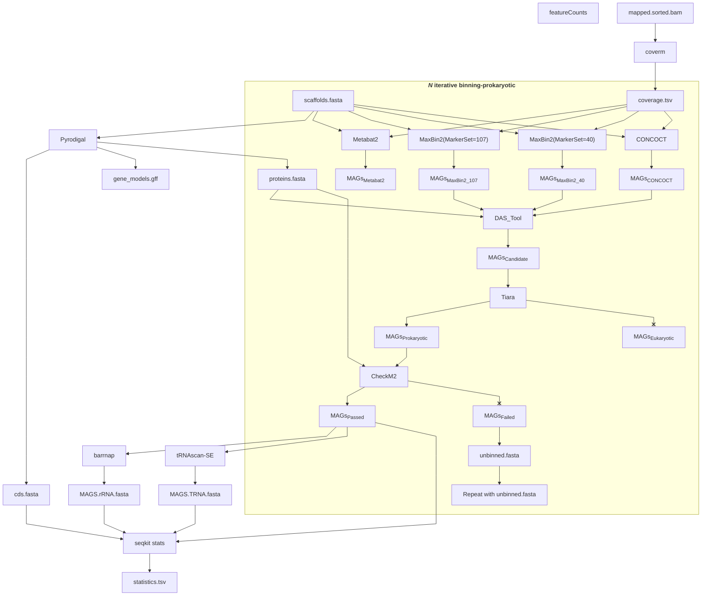

```mermaid
%%{init: { "flowchart": { "curve": "linear" } } }%%

%% Available curve styles include basis, bumpX, bumpY, cardinal, catmullRom, linear, monotoneX, monotoneY, natural, step, stepAfter, and stepBefore. %%%

graph TD


	%% Programs
	COVERM["coverm"]
	PYRODIGAL["Pyrodigal"]
	METABAT2["Metabat2"]
	MAXBIN2_107["MaxBin2(MarkerSet=107)"]
	MAXBIN2_40["MaxBin2(MarkerSet=40)"]
	CONCOCT["CONCOCT"]
	DASTOOL["DAS_Tool"]
	TIARA["Tiara"]
	CHECKM2["CheckM2"]
	BARRNAP["barrnap"]
	TRNASCANSE["tRNAscan-SE"]
	FEATURECOUNTS["featureCounts"]
	SEQKIT["seqkit stats"]

	%% inputs
	ASSEMBLY["scaffolds.fasta"]
	BAM["mapped.sorted.bam"]

	%% outputs
	STATS["statistics.tsv"]
		
	BAM --> COVERM --> COVERAGE["coverage.tsv"]
	ASSEMBLY --> PYRODIGAL --> PROTEINS["proteins.fasta"] & CDS["cds.fasta"] & GFF["gene_models.gff"]

subgraph "`**_N_ iterative binning-prokaryotic**`"

	ASSEMBLY & COVERAGE --> METABAT2 --> MAGS_METABAT["MAGs<SUB>Metabat2</SUB>"]
	ASSEMBLY & COVERAGE --> MAXBIN2_107 --> MAGS_MAXBIN2_107["MAGs<SUB>MaxBin2_107</SUB>"]
	ASSEMBLY & COVERAGE --> MAXBIN2_40 --> MAGS_MAXBIN2_40["MAGs<SUB>MaxBin2_40</SUB>"]
	ASSEMBLY & COVERAGE --> CONCOCT --> MAGS_CONCOCT["MAGs<SUB>CONCOCT</SUB>"]

	MAGS_MAXBIN2_107  & MAGS_MAXBIN2_40 & MAGS_CONCOCT & PROTEINS --> DASTOOL
	
	DASTOOL --> CANDIDATE_MAGS["MAGs<SUB>Candidate</SUB>"]

	CANDIDATE_MAGS --> TIARA
	TIARA --> MAGS_P["MAGs<SUB>Prokaryotic</SUB>"]
	TIARA --x MAGS_E["MAGs<SUB>Eukaryotic</SUB>"]

	MAGS_P & PROTEINS --> CHECKM2

	CHECKM2 --> MAGS_PASSED["MAGs<SUB>Passed</SUB>"]
	CHECKM2 --x MAGS_FAILED["MAGs<SUB>Failed</SUB>"] --> UNBINNED["unbinned.fasta"] --> BEGINNING["Repeat with unbinned.fasta"]


end

MAGS_PASSED --> BARRNAP --> RRNA["MAGS.rRNA.fasta"]
MAGS_PASSED --> TRNASCANSE --> TRNA["MAGS.TRNA.fasta"]

MAGS_PASSED & CDS & RRNA & TRNA --> SEQKIT --> STATS


```