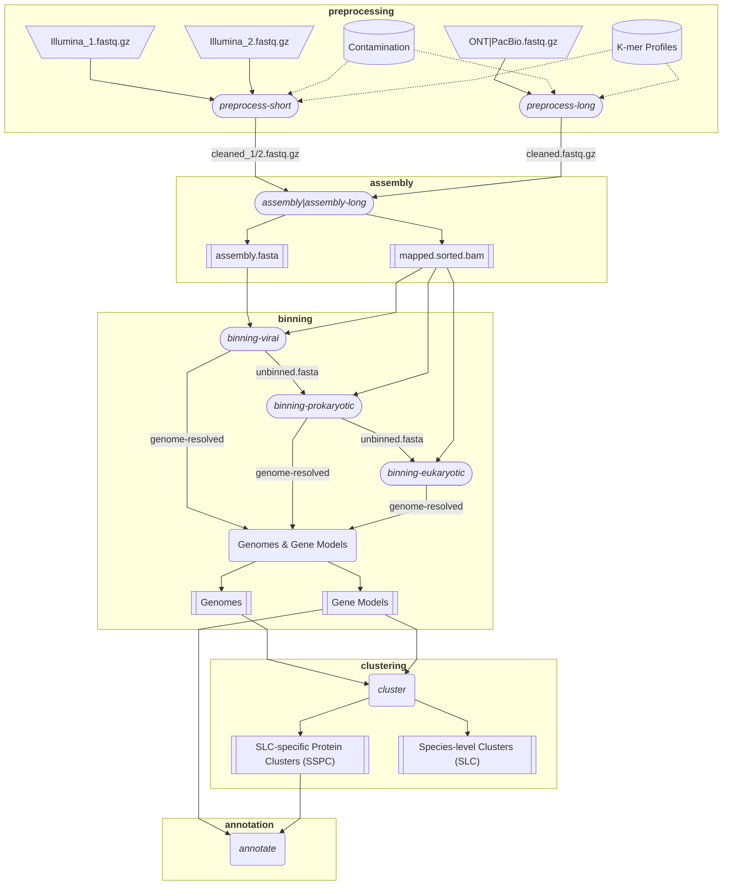

```mermaid
%%{init: { "flowchart": { "curve": "linear" } } }%%

%% Available curve styles include basis, bumpX, bumpY, cardinal, catmullRom, linear, monotoneX, monotoneY, natural, step, stepAfter, and stepBefore. %%%

graph TD
subgraph "`**preprocessing**`"
	%% modules
	PREPROCESS_SHORT(["`_preprocess-short_`"])
	PREPROCESS_LONG(["`_preprocess-long_`"])
	
	%% inputs
	R1[\"Illumina_1.fastq.gz"/]
	R2[\"Illumina_2.fastq.gz"/]
	LONG[\"ONT|PacBio.fastq.gz"/]
	
	
	%% databases
	CONTAMINATION[(Contamination)]
	KMER[(K-mer Profiles)] 
	
	%% ---
	
	
	%% preprocess/-long
	R1 & R2 --> PREPROCESS_SHORT
	CONTAMINATION -.-> PREPROCESS_SHORT
	KMER -.-> PREPROCESS_SHORT
	
	LONG --> PREPROCESS_LONG
	CONTAMINATION -.-> PREPROCESS_LONG
	KMER -.-> PREPROCESS_LONG
end

subgraph "`**assembly**`"
	%%inputs 
	ASSEMBLY(["`_assembly|assembly-long_`"])
	
	%% outputs
	ASSEMBLY_FASTA[["assembly.fasta"]]
	BAM[["mapped.sorted.bam"]]
	
	%% assembly/-long
	PREPROCESS_SHORT --cleaned_1/2.fastq.gz--> ASSEMBLY
	PREPROCESS_LONG --cleaned.fastq.gz--> ASSEMBLY
	ASSEMBLY --> ASSEMBLY_FASTA & BAM
end

%% -- 

subgraph "`**binning**`"
	%% modules
	BINNING_VIRAL(["`_binning-viral_`"])
	BINNING_PROKARYOTIC(["`_binning-prokaryotic_`"])
	BINNING_EUKARYOTIC(["`_binning-eukaryotic_`"])
	
	
	%% outputs
	GENOMES_AND_GENE_MODELS("Genomes & Gene Models")
	GENOMES[["Genomes"]]
	GENE_MODELS[["Gene Models"]]
	
	%% databases
	%%CHECKV[("CheckV")]--> BINNING_VIRAL
	%%GENOMAD[("geNomad")]--> BINNING_VIRAL
	
	%% --
	%% binning-viral
	ASSEMBLY_FASTA & BAM --> BINNING_VIRAL
	
	%% binning-prokaryotic 
	BINNING_VIRAL --unbinned.fasta--> BINNING_PROKARYOTIC
	BAM --> BINNING_PROKARYOTIC
	
	%% binning-eukaryotic
	BINNING_PROKARYOTIC --unbinned.fasta--> BINNING_EUKARYOTIC
	BAM --> BINNING_EUKARYOTIC
	
	%% coverage 
	%% COVERAGE("coverage|coverage-long") 
	
	BINNING_VIRAL & BINNING_PROKARYOTIC & BINNING_EUKARYOTIC --"genome-resolved"--> GENOMES_AND_GENE_MODELS
	GENOMES_AND_GENE_MODELS --> GENOMES & GENE_MODELS


end

%% --

subgraph "`**clustering**`"
	%% modules
	CLUSTER("`_cluster_`")
	
	%% output
	PROTEIN_CLUSTERS[["SLC-specific Protein Clusters (SSPC)"]]
	GENOME_CLUSTERS[["Species-level Clusters (SLC)"]]
	
	
	%% cluster
	GENOMES & GENE_MODELS--> CLUSTER
	CLUSTER --> GENOME_CLUSTERS
	CLUSTER --> PROTEIN_CLUSTERS

end

subgraph "`**annotation**`"
ANNOTATE("`_annotate_`")

GENE_MODELS & PROTEIN_CLUSTERS  --> ANNOTATE
end

```