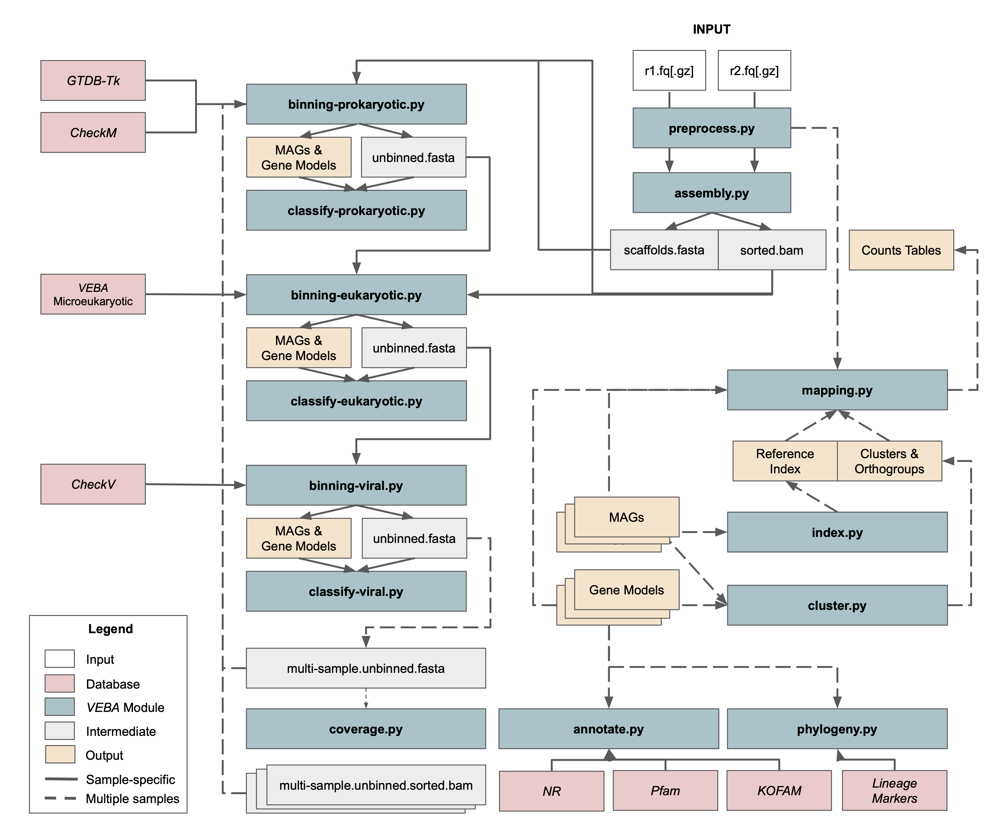

# Modules
[](../images/Schematic.pdf)

| Status        | Environment                  | Module                  | Resources   | Recommended Threads | Description                                                                                                     |
|---------------|------------------------------|-------------------------|-------------|---------------------|-----------------------------------------------------------------------------------------------------------------|
| Stable        | VEBA-preprocess_env          | preprocess.py           | 4GB-16GB    | 4                   | Fastq quality trimming, adapter removal, decontamination, and read statistics calculations                      |
| Stable        | VEBA-assembly_env            | assembly.py             | 32GB-128GB+ | 16                  | Assemble reads, align reads to assembly, and count mapped reads                                                 |
| Stable        | VEBA-assembly_env            | coverage.py             | 24GB        | 16                  | Align reads to (concatenated) reference and counts mapped reads                                                 |
| Stable        | VEBA-binning-prokaryotic_env | binning-prokaryotic.py  | 16GB        | 4                   | Iterative consensus binning for recovering prokaryotic genomes with lineage-specific quality assessment         |
| Stable        | VEBA-binning-eukaryotic_env  | binning-eukaryotic.py   | 128GB       | 4                   | Binning for recovering eukaryotic genomes with exon-aware gene modeling and lineage-specific quality assessment |
| Stable        | VEBA-binning-viral_env       | binning-viral.py        | 16GB        | 4                   | Detection of viral genomes and quality assessment                                                               |
| Stable        | VEBA-classify_env            | classify-prokaryotic.py | 64GB        | 32                  | Taxonomic classification and candidate phyla radiation adjusted quality                                         |
| Stable        | VEBA-classify_env            | classify-eukaryotic.py  | 32GB        | 1                   | Taxonomic classification of eukaryotic genomes                                                                  |
| Stable        | VEBA-classify_env            | classify-viral.py       | 16GB        | 4                   | Taxonomic classification and isolation source of viral genomes                                                  |
| Stable        | VEBA-cluster_env             | cluster.py              | 32GB+       | 32                  | Species-level clustering of genomes and lineage-specific orthogroup detection                                   |
| Stable        | VEBA-annotate_env            | annotate.py             | 64GB        | 32                  | Annotates translated gene calls against NR, Pfam, and KOFAM                                                     |
| Stable        | VEBA-phylogeny_env           | phylogeny.py            | 16GB+       | 32                  | Constructs phylogenetic trees given a marker set                                                                |
| Stable        | VEBA-mapping_env             | index.py                | 16GB        | 4                   | Builds local or global index for alignment to genomes                                                           |
| Stable        | VEBA-mapping_env             | mapping.py              | 16GB        | 4                   | Aligns reads to local or global index of genomes                                                                |
| Developmental | VEBA-biosynthetic_env        | biosynthetic.py         | 16GB        | 16                  | Identify biosynthetic gene clusters in prokaryotes and fungi                                                    |
| Developmental | VEBA-assembly_env            | assembly-sequential.py  | 32GB-128GB+ | 16                  | Assemble metagenomes sequentially                                                                               |
| Developmental | VEBA-amplicon_env            | amplicon.py             | 96GB        | 16                  | Automated read trim position detection, DADA2 ASV detection, taxonomic classification, and file conversion      |

______________________

### Stable

#### preprocess – Fastq quality trimming, adapter removal, decontamination, and read statistics calculations
The preprocess module is a wrapper around our [fastq_preprocessor](https://github.com/jolespin/fastq_preprocessor) which is a modernized reimplementation of [KneadData](https://github.com/biobakery/kneaddata) that relies on fastp for ultra-fast automated adapter removal and quality trimming. Pairing of the trimmed reads is assessed and corrected using [BBTools’ repair.sh](https://sourceforge.net/projects/bbmap). If the user provides a contamination database (e.g., the human reference genome), then trimmed reads are aligned using Bowtie2 (Langmead & Salzberg, 2012) and reads that do not map to the contamination database are stored. If the --retain_contaminated_reads flag is used then the contaminated reads are stored as well. Similarly, if a k-mer reference database is provided (e.g., ribosomal k-mers) then the trimmed or decontaminated reads are aligned against the reference database using BBTools’ bbduk.sh with an option for storing. By default, the none of the contaminated or k-mer analyzed reads are stored but regardless of the choice for retaining reads, the read sets are quantified using seqkit (Shen, Le, Li, & Hu, 2016) for accounting purposes (e.g., % contamination or % ribosomal). All sequences included were downloaded using Kingfisher (https://github.com/wwood/kingfisher-download), included in the preprocess environment, which a fast and flexible program for the procurement of sequencing files and their annotations from public data sources including ENA, NCBI SRA, Amazon AWS, and Google Cloud.

**Conda Environment:** `conda activate VEBA-preprocess_env`

```
usage: preprocess.py -1 <reads_1.fq> -2 <reads_2.fq> -n <name> -o <output_directory> |Optional| -x <reference_index> -k <kmer_database>

    Wrapper around github.com/jolespin/fastq_preprocessor
    Running: preprocess.py v2022.01.19 via Python v3.7.11 | /usr/local/devel/ANNOTATION/jespinoz/anaconda3/envs/VEBA-preprocess_env/bin/python

optional arguments:
  -h, --help            show this help message and exit

Required I/O arguments:
  -1 FORWARD_READS, --forward_reads FORWARD_READS
                        path/to/reads_1.fastq
  -2 REVERSE_READS, --reverse_reads REVERSE_READS
                        path/to/reads_2.fastq
  -n NAME, --name NAME  Name of sample
  -o PROJECT_DIRECTORY, --project_directory PROJECT_DIRECTORY
                        path/to/project_directory [Default: veba_output/preprocess]

Utility arguments:
  --path_config PATH_CONFIG
                        path/to/config.tsv. Must have at least 2 columns [name, executable] [Default: CONDA_PREFIX]
  -p N_JOBS, --n_jobs N_JOBS
                        Number of threads [Default: 1]
  --random_state RANDOM_STATE
                        Random state [Default: 0]
  --restart_from_checkpoint RESTART_FROM_CHECKPOINT
                        Restart from a particular checkpoint
  -v, --version         show program's version number and exit

Fastp arguments:
  -m MINIMUM_READ_LENGTH, --minimum_read_length MINIMUM_READ_LENGTH
                        Fastp | Minimum read length [Default: 75]
  -a ADAPTERS, --adapters ADAPTERS
                        Fastp | path/to/adapters.fasta [Default: detect]
  --fastp_options FASTP_OPTIONS
                        Fastp | More options (e.g. --arg 1 ) [Default: '']

Bowtie2 arguments:
  -x CONTAMINATION_INDEX, --contamination_index CONTAMINATION_INDEX
                        Bowtie2 | path/to/contamination_index
                        (e.g., Human GRCh38 from ftp://ftp.ncbi.nlm.nih.gov/genomes/all/GCA/000/001/405/GCA_000001405.15_GRCh38/seqs_for_alignment_pipelines.ucsc_ids//GCA_000001405.15_GRCh38_no_alt_analysis_set.fna.bowtie_index.tar.gz)
  --retain_trimmed_reads RETAIN_TRIMMED_READS
                        Retain fastp trimmed fastq after decontamination. 0=No, 1=yes [Default: 0]
  --retain_contaminated_reads RETAIN_CONTAMINATED_READS
                        Retain contaminated fastq after decontamination. 0=No, 1=yes [Default: 0]
  --bowtie2_options BOWTIE2_OPTIONS
                        Bowtie2 | More options (e.g. --arg 1 ) [Default: '']
                        http://bowtie-bio.sourceforge.net/bowtie2/manual.shtml

BBDuk arguments:
  -k KMER_DATABASE, --kmer_database KMER_DATABASE
                        BBDuk | path/to/kmer_database
                        (e.g., ribokmers.fa.gz from https://drive.google.com/file/d/0B3llHR93L14wS2NqRXpXakhFaEk/view?usp=sharing)
  --kmer_size KMER_SIZE
                        BBDuk | k-mer size [Default: 31]
  --retain_kmer_hits RETAIN_KMER_HITS
                        Retain reads that map to k-mer database. 0=No, 1=yes [Default: 0]
  --retain_non_kmer_hits RETAIN_NON_KMER_HITS
                        Retain reads that do not map to k-mer database. 0=No, 1=yes [Default: 0]
  --bbduk_options BBDUK_OPTIONS
                        BBDuk | More options (e.g., --arg 1) [Default: '']
```

**Output:**

* cleaned_1.fastq.gz - Cleaned and trimmed fastq file (forward)
* cleaned_2.fastq.gz - Cleaned and trimmed fastq file (reverse)
* seqkit_stats.concatenated.tsv - Concatenated read statistics for all intermediate steps (e.g., fastp, bowtie2 removal of contaminated reads if provided, bbduk.sh removal of contaminated reads if provided)

#### assembly – Assemble reads, align reads to assembly, and count mapped reads
The assembly module optimizes the output for typical metagenomics workflows. In particular, the module does the following: 1) assembles reads using either metaSPAdes (Nurk, Meleshko, Korobeynikov, & Pevzner, 2017), SPAdes (A et al., 2012), rnaSPAdes (Bushmanova, Antipov, Lapidus, & Prjibelski, 2019), any of the other task-specific assemblers installed with the SPAdes package (Antipov, Raiko, Lapidus, & Pevzner, 2020; Meleshko, Hajirasouliha, & Korobeynikov, 2021), or, as of 2022.11.14, MEGAHIT; 2) builds a Bowtie2 index for the scaffolds.fasta (or transcripts.fasta if rnaSPAdes is used); 3) aligns the reads using Bowtie2 to the assembly; 4) pipes the alignment file into Samtools (Li et al., 2009) to produce a sorted BAM file (necessary for many coverage applications); 5) counts the reads mapping to each scaffold via featureCounts (Liao, Smyth, & Shi, 2014); and 6) seqkit for useful assembly statistics such as N50, number of scaffolds, and total assembly size. This module automates many critical yet overlooked workflows dealing with assemblies. 

**Conda Environment**: `conda activate VEBA-assembly_env`

```
usage: assembly.py -1 <forward_reads.fq> -2 <reverse_reads.fq> -n <name> -o <output_directory>

    Running: assembly.py v2022.11.14 via Python v3.9.7 | /Users/jespinoz/anaconda3/bin/python

optional arguments:
  -h, --help            show this help message and exit

Required I/O arguments:
  -1 FORWARD_READS, --forward_reads FORWARD_READS
                        path/to/forward_reads.fq
  -2 REVERSE_READS, --reverse_reads REVERSE_READS
                        path/to/reverse_reads.fq
  -n NAME, --name NAME  Name of sample
  -o PROJECT_DIRECTORY, --project_directory PROJECT_DIRECTORY
                        path/to/project_directory [Default: veba_output/assembly]

Utility arguments:
  --path_config PATH_CONFIG
                        path/to/config.tsv [Default: CONDA_PREFIX]
  -p N_JOBS, --n_jobs N_JOBS
                        Number of threads [Default: 1]
  --random_state RANDOM_STATE
                        Random state [Default: 0]
  --restart_from_checkpoint RESTART_FROM_CHECKPOINT
                        Restart from a particular checkpoint [Default: None]
  -v, --version         show program's version number and exit
  --tmpdir TMPDIR       Set temporary directory

Assembler arguments:
  -P PROGRAM, --program PROGRAM
                        Assembler |  {spades.py, metaspades.py, rnaspades.py, megahit, metaplasmidspades.py, plasmidspades.py, coronaspades.py}} [Default: 'metaspades.py']
  --assembler_options ASSEMBLER_OPTIONS
                        Assembler options for SPAdes-based programs and MEGAHIT (e.g. --arg 1 ) [Default: '']

SPAdes arguments:
  --spades_memory SPADES_MEMORY
                        SPAdes | RAM limit in Gb (terminates if exceeded). [Default: 250]

MEGAHIT arguments:
  --megahit_memory MEGAHIT_MEMORY
                        MEGAHIT | RAM limit in Gb (terminates if exceeded). [Default: 0.9]

Bowtie2 arguments:
  --bowtie2_index_options BOWTIE2_INDEX_OPTIONS
                        bowtie2-build | More options (e.g. --arg 1 ) [Default: '']
  --bowtie2_options BOWTIE2_OPTIONS
                        bowtie2 | More options (e.g. --arg 1 ) [Default: '']

featureCounts arguments:
  --featurecounts_options FEATURECOUNTS_OPTIONS
                        featureCounts | More options (e.g. --arg 1 ) [Default: ''] | http://bioinf.wehi.edu.au/featureCounts/

Copyright 2021 Josh L. Espinoza (jespinoz@jcvi.org)

```

**Output:**

* featurecounts.tsv.gz - featureCounts output for contig-level counts
* mapped.sorted.bam - Sorted BAM
* mapped.sorted.bam.bai - Sorted BAM index
* scaffolds.fasta - Assembly scaffolds (preferred over contigs by SPAdes documentation)
* scaffolds.fasta.\*.bt2 - Bowtie2 index of scaffolds
* scaffolds.fasta.saf - SAF formatted file for contig-level counts with featureCounts
* seqkit_stats.tsv.gz - Assembly statistics


#### coverage – Align reads to (concatenated) reference and counts mapped reads
The coverage module further optimizes the output for typical metagenomics workflows. In particular, the module does the following: 1) filters contigs based on a size filter (default 1500 bp); 2) builds a Bowtie2 index for the coassembly.fasta; 3) aligns the reads from all provided samples using Bowtie2 to the assembly; 4) pipes the alignment file into Samtools to produce a sorted BAM file; 5) counts the reads mapping to each scaffold via featureCounts; and 6) seqkit for useful assembly statistics such as N50, number of scaffolds, and total assembly size (Shen et al., 2016). The preferred usage for this module is after prokaryotic, eukaryotic, and viral binning has been performed and the unbinned contigs are merged into a single coassembly used as input.  The outputs of this module are expected to be used as a final pass through prokaryotic and eukaryotic binning modules.  

**Conda Environment**: `conda activate VEBA-assembly_env`


```
usage: coverage.py -f <reference.fasta> -r <reads.tsv> -o <output_directory>

    Running: coverage.py v2022.04.12 via Python v3.8.5 | /Users/jespinoz/anaconda3/bin/python

optional arguments:
  -h, --help            show this help message and exit

Required I/O arguments:
  -f FASTA, --fasta FASTA
                        path/to/reference.fasta [Required]
  -r READS, --reads READS
                        path/to/reads_table.tsv with the following format: [id_sample]<tab>[path/to/r1.fastq.gz]<tab>[path/to/r2.fastq.gz], No header
  -o OUTPUT_DIRECTORY, --output_directory OUTPUT_DIRECTORY
                        path/to/project_directory [Default: veba_output/assembly/multisample]

Utility arguments:
  --path_config PATH_CONFIG
                        path/to/config.tsv [Default: CONDA_PREFIX]
  -p N_JOBS, --n_jobs N_JOBS
                        Number of threads [Default: 1]
  --random_state RANDOM_STATE
                        Random state [Default: 0]
  --restart_from_checkpoint RESTART_FROM_CHECKPOINT
                        Restart from a particular checkpoint [Default: None]
  -v, --version         show program's version number and exit
  --tmpdir TMPDIR       Set temporary directory

SeqKit seq arguments:
  -m MINIMUM_CONTIG_LENGTH, --minimum_contig_length MINIMUM_CONTIG_LENGTH
                        seqkit seq | Minimum contig length [Default: 1500]
  --seqkit_seq_options SEQKIT_SEQ_OPTIONS
                        seqkit seq | More options (e.g. --arg 1 ) [Default: '']

Bowtie2 arguments:
  --bowtie2_index_options BOWTIE2_INDEX_OPTIONS
                        bowtie2-build | More options (e.g. --arg 1 ) [Default: '']
  --bowtie2_options BOWTIE2_OPTIONS
                        bowtie2 | More options (e.g. --arg 1 ) [Default: '']

featureCounts arguments:
  --featurecounts_options FEATURECOUNTS_OPTIONS
                        featureCounts | More options (e.g. --arg 1 ) [Default: ''] | http://bioinf.wehi.edu.au/featureCounts/
```

**Output:**

* featurecounts.tsv.gz - featureCounts counts table of all samples
* [sample_id]/mapped.sorted.bam - Sorted BAM file under a subdirectory for each sample
* reference.fasta - Reference fasta (typically this would be the pseudo-coassembly of unbinned contigs)
* reference.fasta.saf - SAF formatted file for contig-level counts with featureCounts
* seqkit_stats.tsv - Assembly statistics

#### binning-prokaryotic – Iterative consensus binning for recovering prokaryotic genomes with lineage-specific quality assessment
The prokaryotic binning module implements a novel iterative consensus binning procedure that uses CoverM (https://github.com/wwood/CoverM) for fast coverage calculations, multiple binning algorithms (MaxBin2 (marker set = 107); MaxBin2 (marker set = 40) (Wu et al., 2016); MetaBat2 (Kang et al., 2019); and CONCOCT (Alneberg et al., 2014), consensus dereplication and aggregate binning with DAS Tool (Sieber et al., 2018), the consensus domain wrapper for Tiara (Karlicki et al., 2022) for removing eukaryotes at the MAG level, and CheckM   for quality assessment where poor quality MAGs are removed (e.g., completeness < 50% and/or contamination ≥ 10). The novelty of this procedure is that the unbinned contigs are stored and fed back into the input of the binning procedure using a separate random seed state allowing for an exhaustive, yet effective, approach in extracting high quality and difficult to bin genomes; number of iterations specified by --n\_iter option. Gene calls are performed using Prodigal (Hyatt et al., 2010) and the gene models (GFF3 Format) are modified to include gene and contig identifiers for use with downstream feature counting software. Although CheckM can handle CPR it cannot do so with the typical, and recommended, lineage_wf directly in the current version but instead with a separate workflow. The prokaryotic binning module allows for basal bacteria to filter through intermediate genome quality checks, runs GTDB-Tk (Chaumeil et al., 2020) for genome classification, reruns CheckM CPR workflow for said genomes, and then updates the genome set with adjusted completeness and contamination scores.  The input alignment file is utilized using featureCounts to produce counts tables for the gene models and MAGs.  Lastly, genome statistics such as N50, number of scaffolds, and genome size are calculated using seqkit. Utility scripts, installed with VEBA, are run in the backend to modify prodigal gene models, consensus domain classification of MAGs using Tiara contig predictions, along with several fasta and pre/post-processing scripts. The input to this module is a fasta file (typically the scaffolds.fasta from metaSPAdes) and sorted BAM while the output includes the prokaryotic MAGs via Prodigal, gene models, identifier mappings, counts tables, CheckM output, GTDB-Tk output, and unbinned fasta.  MAG naming scheme for prokaryotes follows [SAMPLE]\_\_\[ALGORITHM\]\_\_P.\[ITERATION\]\_\_\[NAME] (e.g., SRR17458623\_\_METABAT2\_\_P.1\_\_bin.1)

**⚠️Notes:** 

1) If you have a lot of samples and a lot of contigs then use the `--skip_maxbin2` flag because it takes MUCH longer to run.  For the *Plastisphere* it was going to take 40 hours per `MaxBin2` run (there are 2 `MaxBin2` runs) per iteration.  `Metabat2` and `CONCOCT` can do the heavy lifting much faster and often with better results so it's recommended to skip `MaxBin2` for larger datasets.

2) The penultimate step `step-number]__cpr_adjustment]` is the most memory intensive stage as this uses `GTDB-Tk` to identify CPR bacteria. Approaches to properly allocate resources are explained in FAQ. 

Please refer to [FAQ](https://github.com/jolespin/veba/blob/main/FAQ.md) for more details.  In particular, refer to items: 15, 18, 20, and 21.

**Conda Environment**: `conda activate VEBA-binning-prokaryotic_env`


```
usage: binning-prokaryotic.py -f <scaffolds.fasta> -b <mapped.sorted.bam> -n <name> -o <output_directory>

    Running: binning-prokaryotic.py v2022.7.8 via Python v3.8.5 | /Users/jespinoz/anaconda3/bin/python

optional arguments:
  -h, --help            show this help message and exit

Required I/O arguments:
  -f FASTA, --fasta FASTA
                        path/to/scaffolds.fasta
  -b BAM [BAM ...], --bam BAM [BAM ...]
                        path/to/mapped.sorted.bam files separated by spaces.
  -n NAME, --name NAME  Name of sample
  -o PROJECT_DIRECTORY, --project_directory PROJECT_DIRECTORY
                        path/to/project_directory [Default: veba_output/binning/prokaryotic/]

Utility arguments:
  --path_config PATH_CONFIG
                        path/to/config.tsv [Default: CONDA_PREFIX]
  -p N_JOBS, --n_jobs N_JOBS
                        Number of threads [Default: 1]
  -I N_ITER, --n_iter N_ITER
                        Number of iterations to run binning. Use -1 for brute force (-1 isn't ready yet) [Default: 3]
  --random_state RANDOM_STATE
                        Use -1 for completely random. Use 0 for consecutive random states.  Use any other positive integer for the same random state for all iterations [Default: 0]
  --restart_from_checkpoint RESTART_FROM_CHECKPOINT
                        Restart from a particular checkpoint [Default: None]
  -v, --version         show program's version number and exit
  --tmpdir TMPDIR       Set temporary directory

Database arguments:
  --veba_database VEBA_DATABASE
                        VEBA database location.  [Default: $VEBA_DATABASE environment variable]

Binning arguments:
  -m MINIMUM_CONTIG_LENGTH, --minimum_contig_length MINIMUM_CONTIG_LENGTH
                        Minimum contig length.  Anything under 2500 will default to 2500 for MetaBat2 [Default: 1500]
  -s MINIMUM_GENOME_LENGTH, --minimum_genome_length MINIMUM_GENOME_LENGTH
                        Minimum genome length.  [Default: 150000]
  --concoct_fragment_length CONCOCT_FRAGMENT_LENGTH
                        CONCOCT | Fragment length [Default: 10000]
  --concoct_overlap_length CONCOCT_OVERLAP_LENGTH
                        CONCOCT | Fragment overlap length [Default: 0]
  --skip_maxbin2        MaxBin2 | Skip MaxBin2. Useful for large datasets
  --maxbin2_options MAXBIN2_OPTIONS
                        MaxBin2 | More options (e.g. --arg 1 ) [Default: ''] | https://sourceforge.net/projects/maxbin/
  --metabat2_options METABAT2_OPTIONS
                        MetaBat2 | More options (e.g. --arg 1 ) [Default: ''] | https://bitbucket.org/berkeleylab/metabat/src/master/
  --concoct_options CONCOCT_OPTIONS
                        CONCOCT | More options (e.g. --arg 1 ) [Default: '']

Gene model arguments:
  --prodigal_genetic_code PRODIGAL_GENETIC_CODE
                        Prodigal -g translation table [Default: 11]

Evaluation arguments:
  --dastool_searchengine DASTOOL_SEARCHENGINE
                        DAS_Tool searchengine. [Default: diamond] | https://github.com/cmks/DAS_Tool
  --dastool_options DASTOOL_OPTIONS
                        DAS_Tool | More options (e.g. --arg 1 ) [Default: ''] | https://github.com/cmks/DAS_Tool
  --pplacer_threads PPLACER_THREADS
                        Number of threads used for pplacer. Multithreaded uses a lot memory so don't use unless you have the resources [Default: 1]
  --checkm_tree CHECKM_TREE
                        CheckM tree type either 'reduced' or 'full' [Default: reduced]
  --checkm_completeness CHECKM_COMPLETENESS
                        CheckM completeness threshold [Default: 50]
  --checkm_contamination CHECKM_CONTAMINATION
                        CheckM contamination threshold [Default: 10]
  --checkm_strain_heterogeneity CHECKM_STRAIN_HETEROGENEITY
                        CheckM strain hetereogeneity threshold
  --checkm_options CHECKM_OPTIONS
                        CheckM lineage_wf | More options (e.g. --arg 1 ) [Default: '']
  --gtdbtk_options GTDBTK_OPTIONS
                        GTDB-Tk | classify_wf options (e.g. --arg 1 ) [Default: '']

featureCounts arguments:
  --featurecounts_options FEATURECOUNTS_OPTIONS
                        featureCounts | More options (e.g. --arg 1 ) [Default: ''] | http://bioinf.wehi.edu.au/featureCounts/

Domain classification arguments:
  --logit_transform LOGIT_TRANSFORM
                         Transformation for consensus_domain_classification: {softmax, tss} [Default: softmax
  --tiara_minimum_length TIARA_MINIMUM_LENGTH
                        Tiara | Minimum contig length. Anything lower than 3000 is not recommended. [Default: 3000]
  --tiara_options TIARA_OPTIONS
                        Tiara | More options (e.g. --arg 1 ) [Default: ''] | https://github.com/ibe-uw/tiara

```

**Output:**

* binned.list - List of binned contigs
* bins.list - List of MAG identifiers
* checkm_output.filtered.tsv - Filtered CheckM output
* featurecounts.orfs.tsv.gz - ORF-level counts table
* genome_statistics.tsv - Genome assembly statistics
* genomes/ - MAG subdirectory
* genomes/\*.fa - MAG assembly fasta
* genomes/\*.faa - MAG protein fasta
* genomes/\*.ffn - MAG CDS fasta
* genomes/\*.gff - MAG gene models
* genomes/identifier_mapping.tsv - Identifier mapping between [id_orf, id_contig, id_mag]
* gtdbtk_output.filtered.tsv - Filtered GTDBTk output
* scaffolds_to_bins.tsv - Identifier mapping between [id_contig, id_mag]
* unbinned.fasta - Fasta of unbinned contigs that have passed length thresholding
* unbinned.list - List of unbinned contigs

#### binning-eukaryotic – Binning for recovering eukaryotic genomes with exon-aware gene modeling and lineage-specific quality assessment
The eukaryotic binning module uses several checks and state-of-the-art software to ensure high quality genomes.  In particular, non-prokaryotic-biased binning algorithms MetaBat2 [default] (coverage calculated with CoverM) or CONCOCT (coverage calculated using CONCOCT scripts) is used for binning out genomes followed by a genome size filter (2,000,000 bp is the default). The preliminary bins are run through the consensus domain wrapper for Tiara to predict eukaryotic MAGs. We found Tiara to be much more effective than EukRep (even when using an exhaustive parameter grid for EukRep) that we tested on known microeukaryotic contigs/transcripts from published assemblies and transcriptomes (Karlicki et al., 2022; West, Probst, Grigoriev, Thomas, & Banfield, 2018). Contigs from the eukaryotic MAGs are input into MetaEuk easy-predict workflow (Levy Karin et al., 2020) using our custom consensus eukaryotic database (see Database section in Methods). Although MetaEuk is a high-quality software suite, the identifiers from MetaEuk are very complex, long, and contain characters that are often problematic for downstream applications including parsing, file naming systems, and certain programs with simplified identifier requirements such as Anvi’o (Eren et al., 2015). In addition, the gene model GFF files are not intuitive, compatible with Prodigal GFF files or featureCounts without major modification. Therefore, we developed an essential wrapper for MetaEuk that simplifies identifiers (i.e., [ContigID]\_[GeneStart]:\[GeneEnd]([strand])), ensuring no duplicates are produced, creates a GFF file that can be concatenated with the Prodigal GFF file for use with featureCounts, and several identifier mapping tables to seamless convert between original and modified identifiers. Lineage-specific genome quality estimation is performed using BUSCO (Manni et al., 2021) where poor quality MAGs are removed (e.g., completeness < 50%).  Gene counts are computed using featureCounts at the gene level.  Lastly, genome statistics such as N50, number of scaffolds, and genome size are calculated using seqkit. The input to this module is a fasta file (typically the unbinned.fasta from the prokaryotic binning module) and sorted BAM while the output includes the eukaryotic MAGs, gene models via MetaEuk, identifier mappings, BUSCO output, counts tables, and unbinned fasta.  Iterative binning is not currently available as no consensus binning tool is available therefore iterative binning would result in diminishing returns. MAG naming scheme for eukaryotes follows \[SAMPLE]\_\_\[ALGORITHM]\_\_E.[ITERATION]\_\_\[NAME] (e.g., ERR2002407\_\_METABAT2\_\_E.1\_\_bin.2).

**Conda Environment**: `conda activate VEBA-binning-eukaryotic_env`


```
usage: binning-eukaryotic.py -f <scaffolds.fasta> -b <mapped.sorted.bam> -n <name> -o <output_directory>

    Running: binning-eukaryotic.py v2022.7.8 via Python v3.8.5 | /Users/jespinoz/anaconda3/bin/python

optional arguments:
  -h, --help            show this help message and exit

I/O arguments:
  -f FASTA, --fasta FASTA
                        path/to/scaffolds.fasta
  -b BAM [BAM ...], --bam BAM [BAM ...]
                        path/to/mapped.sorted.bam files separated by spaces.
  -n NAME, --name NAME  Name of sample
  -l CONTIG_IDENTIFIERS, --contig_identifiers CONTIG_IDENTIFIERS
                        path/to/contigs.list [Optional]
  -o PROJECT_DIRECTORY, --project_directory PROJECT_DIRECTORY
                        path/to/project_directory [Default: veba_output/binning/eukaryotic]

Utility arguments:
  --path_config PATH_CONFIG
                        path/to/config.tsv [Default: CONDA_PREFIX]
  -p N_JOBS, --n_jobs N_JOBS
                        Number of threads [Default: 1]
  --random_state RANDOM_STATE
                        Random state [Default: 0]
  --restart_from_checkpoint RESTART_FROM_CHECKPOINT
                        Restart from a particular checkpoint [Default: None]
  -v, --version         show program's version number and exit

Database arguments:
  --veba_database VEBA_DATABASE
                        VEBA database location.  [Default: $VEBA_DATABASE environment variable]

Binning arguments:
  -a ALGORITHM, --algorithm ALGORITHM
                        Binning algorithm: {concoct, metabat2}  [Default: metabat2]
  -m MINIMUM_CONTIG_LENGTH, --minimum_contig_length MINIMUM_CONTIG_LENGTH
                        Minimum contig length.  [Default: 1500]
  -s MINIMUM_GENOME_LENGTH, --minimum_genome_length MINIMUM_GENOME_LENGTH
                        Minimum genome length.  [Default: 2000000]
  --concoct_fragment_length CONCOCT_FRAGMENT_LENGTH
                        CONCOCT | Fragment length [Default: 10000]
  --concoct_overlap_length CONCOCT_OVERLAP_LENGTH
                        CONCOCT | Fragment overlap length [Default: 0]
  --concoct_options CONCOCT_OPTIONS
                        CONCOCT | More options (e.g. --arg 1 ) [Default: '']
  --metabat2_options METABAT2_OPTIONS
                        MetaBat2 | More options (e.g. --arg 1 ) [Default: ''] | https://bitbucket.org/berkeleylab/metabat/src/master/

Domain classification arguments:
  --logit_transform LOGIT_TRANSFORM
                         Transformation for consensus_domain_classification: {softmax, tss} [Default: softmax
  --tiara_minimum_length TIARA_MINIMUM_LENGTH
                        Tiara | Minimum contig length. Anything lower than 3000 is not recommended. [Default: 3000]
  --tiara_options TIARA_OPTIONS
                        Tiara | More options (e.g. --arg 1 ) [Default: ''] | https://github.com/ibe-uw/tiara

MetaEuk arguments:
  --metaeuk_sensitivity METAEUK_SENSITIVITY
                        MetaEuk | Sensitivity: 1.0 faster; 4.0 fast; 7.5 sensitive  [Default: 4.0]
  --metaeuk_evalue METAEUK_EVALUE
                        MetaEuk | List matches below this E-value (range 0.0-inf) [Default: 0.01]
  --metaeuk_options METAEUK_OPTIONS
                        MetaEuk | More options (e.g. --arg 1 ) [Default: ''] https://github.com/soedinglab/metaeuk

BUSCO arguments:
  --busco_completeness BUSCO_COMPLETENESS
                        BUSCO completeness [Default: 50.0]
  --busco_contamination BUSCO_CONTAMINATION
                        BUSCO contamination [Default: 10.0]
  --busco_evalue BUSCO_EVALUE
                        BUSCO | E-value cutoff for BLAST searches. Allowed formats, 0.001 or 1e-03 [Default: 1e-03]

featureCounts arguments:
  --featurecounts_options FEATURECOUNTS_OPTIONS
                        featureCounts | More options (e.g. --arg 1 ) [Default: ''] | http://bioinf.wehi.edu.au/featureCounts/

```

**Output:**

* binned.list - List of binned contigs
* bins.list - List of MAG identifiers
* busco_results.filtered.tsv - Filtered BUSCO output
* featurecounts.orfs.tsv.gz - ORF-level counts table
* genome_statistics.tsv - Genome assembly statistics
* genomes/ - MAG subdirectory
* genomes/\*.fa - MAG assembly fasta
* genomes/\*.faa - MAG protein fasta
* genomes/\*.ffn - MAG CDS fasta
* genomes/\*.gff - MAG gene models
* genomes/identifier_mapping.tsv - Identifier mapping between [id_orf, id_contig, id_mag]
* identifier_mapping.metaeuk.tsv - Identifier mapping between original MetaEuk identifiers and modified identifiers.  Includes fully parsed MetaEuk identifiers.
* scaffolds_to_bins.tsv - Identifier mapping between [id_contig, id_mag]
* unbinned.fasta - Fasta of unbinned contigs that have passed length thresholding
* unbinned.list - List of unbinned contigs

#### binning-viral – Detection of viral genomes and quality assessment
Viral binning is performed using VirFinder (Ren et al., 2017) to extract potential viral contigs (e.g., P < 0.05). The potential viral contigs are then input into CheckV (Nayfach et al., 2020) where quality assessment removes poor quality or low confidence viral predictions. The filtering scheme is based on author recommendations (Nayfach, 2021) in which a viral contig is considered if it meets the following criteria: 1) number of viral genes ≥ 5 x number of host genes; 2) completeness ≥ 50%; 3) CheckV quality is either medium-quality, high-quality, or complete; and 4) MIUViG quality is either medium-quality, high-quality, or complete (Roux et al., 2018).  Proviruses can be included by using the --include_proviruses flag. After poor quality viral contigs are removed, Prodigal is used for gene modeling and seqkit is used for useful genome statistics.  The input to this module is a fasta file (typically the unbinned.fasta from the eukaryotic binning module) while the output includes the viral MAGs, gene models via Prodigal, identifier mappings, and CheckV output.  Iterative binning is not applicable for viral detection as algorithms are executed on a per-contig basis and all viral genomes will be identified on first pass.  MAG naming scheme for viruses follows [SAMPLE]\_\_\[ALGORITHM]\_\_\[NAME] (e.g., SRR9668957\_\_VIRFINDER\_\_Virus.1).

**Conda Environment**: `conda activate VEBA-binning-viral_env`

```
usage: binning-viral.py -f <scaffolds.fasta> -l <contig_identifiers> -n <name> -o <output_directory>

    Running: binning-viral.py v2022.7.8 via Python v3.8.5 | /Users/jespinoz/anaconda3/bin/python

optional arguments:
  -h, --help            show this help message and exit

Required I/O arguments:
  -f FASTA, --fasta FASTA
                        path/to/scaffolds.fasta
  -n NAME, --name NAME  Name of sample
  -l CONTIG_IDENTIFIERS, --contig_identifiers CONTIG_IDENTIFIERS
                        path/to/contigs.list [Optional]
  -o PROJECT_DIRECTORY, --project_directory PROJECT_DIRECTORY
                        path/to/project_directory [Default: veba_output/binning/viral]
  -b BAM [BAM ...], --bam BAM [BAM ...]
                        path/to/mapped.sorted.bam files separated by spaces.

Utility arguments:
  --path_config PATH_CONFIG
                        path/to/config.tsv [Default: CONDA_PREFIX]
  -p N_JOBS, --n_jobs N_JOBS
                        Number of threads [Default: 1]
  --random_state RANDOM_STATE
                        Random state [Default: 0]
  --restart_from_checkpoint RESTART_FROM_CHECKPOINT
                        Restart from a particular checkpoint [Default: None]
  -v, --version         show program's version number and exit
  --remove_temporary_fasta
                        If contig identifiers were provided and a fasta is generated, remove this file

Database arguments:
  --veba_database VEBA_DATABASE
                        VEBA database location.  [Default: $VEBA_DATABASE environment variable]

Binning arguments:
  -m MINIMUM_CONTIG_LENGTH, --minimum_contig_length MINIMUM_CONTIG_LENGTH
                        Minimum contig length.  [Default: 1500]

Gene model arguments:
  --prodigal_genetic_code PRODIGAL_GENETIC_CODE
                        Prodigal -g translation table [Default: 11]

Virus arguments:
  --include_provirus    Include provirus viral detection
  --virfinder_pvalue VIRFINDER_PVALUE
                        VirFinder p-value threshold [Default: 0.05]
  --virfinder_options VIRFINDER_OPTIONS
                        VirFinder | More options (e.g. --arg 1 ) [Default: '']
  --checkv_options CHECKV_OPTIONS
                        CheckV | More options (e.g. --arg 1 ) [Default: '']
  --multiplier_viral_to_host_genes MULTIPLIER_VIRAL_TO_HOST_GENES
                        Minimum number of viral genes [Default: 5]
  --checkv_completeness CHECKV_COMPLETENESS
                        Minimum completeness [Default: 50.0]
  --checkv_quality CHECKV_QUALITY
                        Comma-separated string of acceptable arguments between {High-quality,Medium-quality,Complete} [Default: High-quality,Medium-quality,Complete]
  --miuvig_quality MIUVIG_QUALITY
                        Comma-separated string of acceptable arguments between {High-quality,Medium-quality,Complete} [Default: High-quality,Medium-quality,Complete]

```

**Output:**

* binned.list - List of binned contigs
* bins.list - List of MAG identifiers
* quality_summary.filtered.tsv - Filtered CheckV output
* featurecounts.orfs.tsv.gz - ORF-level counts table (If --bam file is provided)
* genome_statistics.tsv - Genome assembly statistics
* genomes/ - MAG subdirectory
* genomes/\*.fa - MAG assembly fasta
* genomes/\*.faa - MAG protein fasta
* genomes/\*.ffn - MAG CDS fasta
* genomes/\*.gff - MAG gene models
* genomes/identifier_mapping.tsv - Identifier mapping between [id_orf, id_contig, id_mag]
* scaffolds_to_bins.tsv - Identifier mapping between [id_contig, id_mag]
* unbinned.fasta - Fasta of unbinned contigs that have passed length thresholding
* unbinned.list - List of unbinned contigs


#### classify-prokaryotic – Taxonomic classification and candidate phyla radiation adjusted quality assessment of prokaryotic genomes
The prokaryotic classification module is a useful wrapper around GTDB-Tk which either combines the resulting archaea and bacteria summary tables or runs GTDB-Tk lineage_wf from the beginning.  If genome clusters are provided, then it performs consensus lineage classification.

**Conda Environment**: `conda activate VEBA-classify_env`


```
usage: classify-prokaryotic.py -i <prokaryotic_binning_directory> -o <output_directory>

    Running: classify-prokaryotic.py v2022.06.07 via Python v3.8.5 | /Users/jespinoz/anaconda3/bin/python

optional arguments:
  -h, --help            show this help message and exit

Required I/O arguments:
  -i PROKARYOTIC_BINNING_DIRECTORY, --prokaryotic_binning_directory PROKARYOTIC_BINNING_DIRECTORY
                        path/to/prokaryotic_binning_directory
  -c CLUSTERS, --clusters CLUSTERS
                        path/to/clusters.tsv, Format: [id_mag]<tab>[id_cluster], No header.
  -o OUTPUT_DIRECTORY, --output_directory OUTPUT_DIRECTORY
                        path/to/output_directory [Default: veba_output/classify/prokaryotic]
  -x EXTENSION, --extension EXTENSION
                        Fasta file extension for genomes if a list is provided [Default: fa]

Utility arguments:
  --path_config PATH_CONFIG
                        path/to/config.tsv [Default: CONDA_PREFIX]
  --tmpdir TMPDIR       path/to/TMPDIR [Default: /var/folders/fl/bh6r17mn52d33ycwvk70z2bc0003c0/T/]
  -p N_JOBS, --n_jobs N_JOBS
                        Number of threads [Default: 1]
  --random_state RANDOM_STATE
                        Random state [Default: 0]
  --restart_from_checkpoint RESTART_FROM_CHECKPOINT
                        Restart from a particular checkpoint [Default: None]
  -v, --version         show program's version number and exit

Database arguments:
  --veba_database VEBA_DATABASE
                        VEBA database location.  [Default: $VEBA_DATABASE environment variable]

GTDB-Tk arguments:
  --gtdbtk_options GTDBTK_OPTIONS
                        GTDB-Tk | classify_wf options (e.g. --arg 1 ) [Default: '']

Consensus genome classification arguments:
  -l LENIENCY, --leniency LENIENCY
                        Leniency parameter. Lower value means more conservative weighting. A value of 1 indiciates no weight bias. A value greater than 1 puts higher weight on higher level taxonomic assignments. A value less than 1 puts lower weights on higher level taxonomic assignments.  [Default: 1.382]


```


**Output:**

* prokaryotic_taxonomy.tsv - Prokaryotic genome classification based on GTDBTk
* prokaryotic_taxonomy.clusters.tsv - Prokaryotic cluster classification (If --clusters are provided)
                        
#### classify-eukaryotic – Taxonomic classification of eukaryotic genomes
The eukaryotic classification module utilizes the target field of MetaEuk gene identifiers and the taxonomic lineage associated with each source genome.  The default marker set is eukaryote_odb10 from BUSCO but custom marker sets are support along with the inclusion of all genes not just marker genes.  An option to include marker-specific noise cutoff scores is also available using the --scores_cutoff parameter which is default behavior with BUSCO’s eukaryote_odb10 provided noise thresholds.  For each MAG, bitscores are accumulated for each taxonomic level and taxonomy is assigned with leniency specified by the leniency parameter with high leniency resulting higher order taxonomic assignments.  If genome clusters are provided, then it performs consensus lineage classification. EUKulele (Krinos, Hu, Cohen, & Alexander, 2021) was attempted for this stage but a custom database could not be created with the software, likely due to the dependency of supergroup and division fields that were missing for certain taxa.  However, future implementations of VEBA may use this if such issues are resolved.  

**Conda Environment**: `conda activate VEBA-classify_env` 

```
usage: classify-eukaryotic.py -i <eukaryotic_binning_directory> -o <output_directory>

    Running: classify-eukaryotic.py v2022.7.8 via Python v3.8.5 | /Users/jespinoz/anaconda3/bin/python

optional arguments:
  -h, --help            show this help message and exit

Required I/O arguments:
  -i EUKARYOTIC_BINNING_DIRECTORY, --eukaryotic_binning_directory EUKARYOTIC_BINNING_DIRECTORY
                        path/to/eukaryotic_binng_directory
  -c CLUSTERS, --clusters CLUSTERS
                        path/to/clusters.tsv, Format: [id_mag]<tab>[id_cluster], No header.
  -o OUTPUT_DIRECTORY, --output_directory OUTPUT_DIRECTORY
                        path/to/output_directory [Default: veba_output/classify/eukaryotic]

Utility arguments:
  --path_config PATH_CONFIG
                        path/to/config.tsv [Default: CONDA_PREFIX]
  -p N_JOBS, --n_jobs N_JOBS
                        Number of threads [Default: 1]
  --random_state RANDOM_STATE
                        Random state [Default: 0]
  --restart_from_checkpoint RESTART_FROM_CHECKPOINT
                        Restart from a particular checkpoint [Default: None]
  -v, --version         show program's version number and exit

HMMSearch arguments:
  --hmmsearch_threshold HMMSEARCH_THRESHOLD
                        HMMSearch | Threshold {cut_ga, cut_nc, gut_tc, e} [Default:  e]
  --hmmsearch_evalue HMMSEARCH_EVALUE
                        HMMSearch | E-Value [Default: 10.0]
  --hmmsearch_options HMMSEARCH_OPTIONS
                        HMMSearch | More options (e.g. --arg 1 ) [Default: '']

Database arguments:
  --veba_database VEBA_DATABASE
                        VEBA database location.  [Default: $VEBA_DATABASE environment variable]
  --include_all_genes   Use if you want to include all genes for taxonomy classification instead of only core markers from BUSCO's eukaryota_odb10

Consensus genome arguments:
  -l LENIENCY, --leniency LENIENCY
                        Leniency parameter. Lower value means more conservative weighting. A value of 1 indiciates no weight bias. A value greater than 1 puts higher weight on higher level taxonomic assignments. A value less than 1 puts lower weights on higher level taxonomic assignments.  [Default: 1.382]
  --similarity_threshold SIMILARITY_THRESHOLD
                        Threshold for similarity analysis [Default: 0.8]
  --retain_unannotated RETAIN_UNANNOTATED
                        Consider unannotations (i.e., blank functions) in the scording system [Default: 1]
  --unannotated_weight UNANNOTATED_WEIGHT
                        Weight for unannotations (i.e., blank functions) in the scording system? [Default: 0.382]
  --representative_threshold REPRESENTATIVE_THRESHOLD
                        Score to consider as representative [Default: 0.618]

``` 

**Output:**

* eukaryotic_taxonomy.tsv - Eukaryotic genome classification based on microeukaryotic protein database and BUSCO's eukaryota_odb10 marker set
* eukaryotic_taxonomy.clusters.tsv - Eukaryotic cluster classification (If --clusters are provided)
* gene-source_lineage.tsv - Gene source lineage and scores for classifying MAGs [id_gene, id_scaffold, id_mag, id_target, id_source, lineage, bitscore]


#### classify-viral – Taxonomic classification and isolation source of viral genomes
The viral classification module utilizes the CheckV database along with the best hit lineage and source habitat information from the CheckV output.  This includes a look up of CheckV identifiers based on direct terminal repeats and GenBank identifiers when applicable. If genome clusters are provided, then it performs consensus lineage classification and consensus habitat annotation. 

**Conda Environment**: `conda activate VEBA-classify_env`

```
usage: classify-viral.py -i <viral_binning_directory>  -o <output_directory>

    Running: classify-viral.py v2022.7.8 via Python v3.8.5 | /Users/jespinoz/anaconda3/bin/python

optional arguments:
  -h, --help            show this help message and exit

Required I/O arguments:
  -i VIRAL_BINNING_DIRECTORY, --viral_binning_directory VIRAL_BINNING_DIRECTORY
                        Either: path/to/checkv/quality_summary.tsv or directory of veba_output/binning/viral
  -c CLUSTERS, --clusters CLUSTERS
                        path/to/clusters.tsv, Format: [id_mag]<tab>[id_cluster], No header.
  -o OUTPUT_DIRECTORY, --output_directory OUTPUT_DIRECTORY
                        path/to/output_directory [Default: veba_output/classify/viral]

Utility arguments:
  --path_config PATH_CONFIG
                        path/to/config.tsv [Default: CONDA_PREFIX]
  --restart_from_checkpoint RESTART_FROM_CHECKPOINT
                        Restart from a particular checkpoint [Default: None]
  -v, --version         show program's version number and exit

Database arguments:
  --veba_database VEBA_DATABASE
                        VEBA database location.  [Default: $VEBA_DATABASE environment variable]

Consensus habitat/isolation source arguments:
  --similarity_threshold SIMILARITY_THRESHOLD
                        Threshold for similarity analysis [Default: 0.8]
  --retain_unannotated RETAIN_UNANNOTATED
                        Consider unannotations (i.e., blank functions) in the scording system [Default: 1]
  --unannotated_weight UNANNOTATED_WEIGHT
                        Weight for unannotations (i.e., blank functions) in the scording system? [Default: 0.382]
  --representative_threshold REPRESENTATIVE_THRESHOLD
                        Score to consider as representative [Default: 0.618]

```

**Output:**

* viral\_taxonomy.tsv - Viral genome classification based on CheckV classifications
* viral\_taxonomy.clusters.tsv - Viral cluster classification (If --clusters are provided)
* viral\_isolation\_source.clusters.tsv - Viral isolation source consensus (If --clusters are provided)

#### cluster – Species-level clustering of genomes and lineage-specific orthogroup detection
To leverage intra-sample genome analysis in an inter-sample analytical paradigm, genome clustering and lineage-specific orthogroup detection is necessary.  The cluster module first uses FastANI (Jain, Rodriguez-R, Phillippy, Konstantinidis, & Aluru, 2018) to compute pairwise ANI and these are used to construct a NetworkX graph object where nodes are genomes and edges are ANI values (Hagberg, Schult, & Swart, 2008).  This graph is converted into subgraphs of connected components whose edges are connected by a particular threshold such as 95% ANI [default] as recommended by the authors for species-level clustering.  These species-level clusters (SLC) are then partitioned and OrthoFinder (Emms & Kelly, 2019) is then run on each SLC panproteome. The input is a list of genome paths and list of protein fasta paths while the output includes identifier mappings between genomes, SLCs, scaffolds, proteins, and orthogroups.

**Conda Environment**: `conda activate VEBA-cluster_env`

```
usage: cluster.py -m <mags> -a <proteins> -o <output_directory> -t 95

    Running: cluster.py v2022.02.24 via Python v3.9.10 | /usr/local/devel/ANNOTATION/jespinoz/anaconda3/envs/VEBA-mapping_env/bin/python

optional arguments:
  -h, --help            show this help message and exit

Required I/O arguments:
  -i SCAFFOLDS_TO_BINS, --scaffolds_to_bins SCAFFOLDS_TO_BINS
                        path/to/scaffolds_to_bins.tsv, Format: [id_scaffold]<tab>[id_bin], No header
  -m MAGS, --mags MAGS  Tab-seperated value table of [id_mag]<tab>[path/to/genome.fasta]
  -a PROTEINS, --proteins PROTEINS
                        Tab-seperated value table of [id_mag]<tab>[path/to/protein.fasta]
  -o OUTPUT_DIRECTORY, --output_directory OUTPUT_DIRECTORY
                        path/to/project_directory [Default: veba_output/cluster]
  --mags_extension MAGS_EXTENSION
                        Fasta file extension for --mags if a list is provided [Default: fa]
  --proteins_extension PROTEINS_EXTENSION
                        Fasta file extension for proteins if a list is provided [Default: faa]

Utility arguments:
  --path_config PATH_CONFIG
                        path/to/config.tsv [Default: CONDA_PREFIX]
  -p N_JOBS, --n_jobs N_JOBS
                        Number of threads [Default: 1]
  --cluster_only        Only run FastANI
  --random_state RANDOM_STATE
                        Random state [Default: 0]
  --restart_from_checkpoint RESTART_FROM_CHECKPOINT
                        Restart from a particular checkpoint [Default: None]
  -v, --version         show program's version number and exit

FastANI arguments:
  -t ANI_THRESHOLD, --ani_threshold ANI_THRESHOLD
                        FastANI | Species-level clustering threshold [Default: 95.0]
  --fastani_options FASTANI_OPTIONS
                        FastANI | More options (e.g. --arg 1 ) [Default: '']
  --cluster_prefix CLUSTER_PREFIX
                        Cluster prefix [Default: 'SLC
  --cluster_suffix CLUSTER_SUFFIX
                        Cluster suffix [Default: '
  --copy_proteins       Copy instead of symlink
  --clone_label CLONE_LABEL
                        Singleton clone label [Default: '___clone

OrthoFinder arguments:
  --orthofinder_options ORTHOFINDER_OPTIONS
                        OrthoFinder | More options (e.g. --arg 1 ) [Default: '']

```
**Output:**

* clusters.tsv - Identifier mapping between MAGs and clusters [id_mag, id_cluster]
* identifier_mapping.orthogroups.tsv - Identifier mapping between ORFs, contigs, orthogroups, and clusters
* proteins_to_orthogroups.tsv - Identifier mapping between ORFs and orthogroups [id_orf, id_orthogroup]
* scaffolds_to_clusters.tsv - Identifier mapping between contigs and clusters [id_contig, id_cluster]

*Note: This should be run separately for prokaryotes, eukaryotes, and viruses. 

Here is the suggested directory structure:
* veba_output/cluster/prokaryotic
* veba_output/cluster/eukaryotic
* veba_output/cluster/viral

#### annotate – Annotates translated gene calls against NR, Pfam, and KOFAM
Annotation is performed using best hit annotations and profile HMMs.  First proteins are aligned against NCBI non-redundant protein database (other databases are supported) using Diamond (Buchfink, Reuter, & Drost, 2021; Buchfink, Xie, & Huson, 2014). After annotation, protein domains are identified using the Pfam database (Mistry et al., 2021) via HMMER (Mistry, Finn, Eddy, Bateman, & Punta, 2013) and KEGG orthology is characterized via KOFAMSCAN (Aramaki et al., 2020).  Note, the `lineage_predictions.*.tsv` files generated here are experimental.

**Conda Environment**: `conda activate VEBA-annotate_env`

```
usage: annotate.py -i <identifier_mapping> -a <proteins> -o <output_directory>

    Running: annotate.py v2021.7.8 via Python v3.8.5 | /Users/jespinoz/anaconda3/bin/python

optional arguments:
  -h, --help            show this help message and exit

Required I/O arguments:
  -a PROTEINS, --proteins PROTEINS
                        Either path/to/proteins.faa or a directory of fasta files using [-x]
  -i IDENTIFIER_MAPPING, --identifier_mapping IDENTIFIER_MAPPING
                        Tab-seperated value table of [id_orf]<tab>[id_contig]<tab>[id_mag]
  -o OUTPUT_DIRECTORY, --output_directory OUTPUT_DIRECTORY
                        path/to/project_directory [Default: veba_output/annotation]
  -x EXTENSION, --extension EXTENSION
                        Fasta file extension for proteins if a directory is provided for --proteins [Default: faa]

Utility arguments:
  --path_config PATH_CONFIG
                        path/to/config.tsv [Default: CONDA_PREFIX]
  -p N_JOBS, --n_jobs N_JOBS
                        Number of threads [Default: 1]
  --random_state RANDOM_STATE
                        Random state [Default: 0]
  --restart_from_checkpoint RESTART_FROM_CHECKPOINT
                        Restart from a particular checkpoint [Default: None]
  --keep_temporary_directory
                        Keep temporary directory [Default is to remove]
  -v, --version         show program's version number and exit

Database arguments:
  --veba_database VEBA_DATABASE
                        VEBA database location.  [Default: $VEBA_DATABASE environment variable]

Diamond arguments:
  --diamond_sensitivity DIAMOND_SENSITIVITY
                        Diamond | Sensitivity [Default:  '']
  --diamond_evalue DIAMOND_EVALUE
                        Diamond | E-Value [Default: 0.001]
  --diamond_options DIAMOND_OPTIONS
                        Diamond | More options (e.g. --arg 1 ) [Default: '']

HMMSearch arguments:
  --hmmsearch_threshold HMMSEARCH_THRESHOLD
                        HMMSearch | Threshold {cut_ga, cut_nc, gut_tc} [Default:  cut_ga]
  --hmmsearch_options HMMSEARCH_OPTIONS
                        Diamond | More options (e.g. --arg 1 ) [Default: '']

KOFAMSCAN arguments:
  --kofamscan_options KOFAMSCAN_OPTIONS
                        Diamond | More options (e.g. --arg 1 ) [Default: '']

```

**Output:**

* annotations.orfs.tsv.gz - Concatenated annotations from Diamond (NR), HMMSearch (Pfam), and KOFAMSCAN (KOFAM)
* lineage_predictions.contigs.tsv.gz - [Experimental] Lineage predictions for contigs based on NR annotations.  This should be used only for experimentation as many lineages aren't defined properly. Contig-level classifications.
* lineage_predictions.mags.tsv.gz - [Experimental] Lineage predictions for contigs based on NR annotations.  This should be used only for experimentation as many lineages aren't defined properly. MAG-level classifications.


#### phylogeny – Constructs phylogenetic trees given a marker set
The phylogeny module is a tool used for phylogenetic inference and constructing phylogenetic trees for genomes given a reference marker set (see Databases section of Methods). This is performed by the following method: 1) identifying marker proteins using HMMSearch from the HMMER3 suite; 2) creating protein alignments for each marker identified MUSCLE (Edgar, 2004); 3) trimming the alignments using ClipKIT (Steenwyk, Buida, Li, Shen, & Rokas, 2020); 4) concatenating the alignments; 5) approximately-maximum-likelihood phylogenetic inference using FastTree2 (Price, Dehal, & Arkin, 2010); and 6) optional maximum likelihood phylogenetic inference using IQ-TREE2 (Minh et al., 2020).  An option to include marker-specific noise cutoff scores is also available using the --scores_cutoff parameter.  Poor-quality genomes that do not meet a threshold in the proportion of markers in the reference are removed using the --minimum_markers_aligned_ratio parameter.  Similarly, non-informative markers that are not prevalent in the query genomes are removed using the --minimum_genomes_aligned_ratio parameter.

**Conda Environment**: `conda activate VEBA-phylogeny_env`


```
usage: phylogeny.py -d <database_hmms> -a <proteins> -o <output_directory>

    Running: phylogeny.py v2022.06.22 via Python v3.8.5 | /Users/jespinoz/anaconda3/bin/python

optional arguments:
  -h, --help            show this help message and exit

Required I/O arguments:
  -d DATABASE_HMM, --database_hmm DATABASE_HMM
                        path/to/HMM database of markers
  -a PROTEINS, --proteins PROTEINS
                        Can be the following format: 1) Tab-seperated value table of [id_mag]<tab>[path/to/protein.fasta]; 2) List of filepaths [path/to/protein.fasta]; or 3) Directory of protein fasta using --protein_extension
  -o OUTPUT_DIRECTORY, --output_directory OUTPUT_DIRECTORY
                        path/to/project_directory [Default: veba_output/phylogeny]
  -x EXTENSION, --extension EXTENSION
                        Fasta file extension for proteins if a list is provided [Default: faa]

Utility arguments:
  --path_config PATH_CONFIG
                        path/to/config.tsv [Default: CONDA_PREFIX]
  -p N_JOBS, --n_jobs N_JOBS
                        Number of threads [Default: 1]
  --random_state RANDOM_STATE
                        Random state [Default: 0]
  --restart_from_checkpoint RESTART_FROM_CHECKPOINT
                        Restart from a particular checkpoint [Default: None]
  -v, --version         show program's version number and exit

HMMSearch arguments:
  --hmmsearch_threshold HMMSEARCH_THRESHOLD
                        HMMSearch | Threshold {cut_ga, cut_nc, gut_tc, e} [Default:  e]
  --hmmsearch_evalue HMMSEARCH_EVALUE
                        Diamond | E-Value [Default: 10.0]
  --hmmsearch_options HMMSEARCH_OPTIONS
                        Diamond | More options (e.g. --arg 1 ) [Default: '']
  -f HMM_MARKER_FIELD, --hmm_marker_field HMM_MARKER_FIELD
                        HMM reference type (accession, name) [Default: accession
  -s SCORES_CUTOFF, --scores_cutoff SCORES_CUTOFF
                        path/to/scores_cutoff.tsv. No header. [id_hmm]<tab>[score]

Alignment arguments:
  -g MINIMUM_GENOMES_ALIGNED_RATIO, --minimum_genomes_aligned_ratio MINIMUM_GENOMES_ALIGNED_RATIO
                        Minimum ratio of genomes include in alignment. This removes markers that are under represented. [Default: 0.95]
  -m MINIMUM_MARKERS_ALIGNED_RATIO, --minimum_markers_aligned_ratio MINIMUM_MARKERS_ALIGNED_RATIO
                        Minimum ratio of markers aligned. This removes genomes with few markers. Note, this is based on detected markers and NOT total markers in original HMM. [Default: 0.2]
  --muscle_options MUSCLE_OPTIONS
                        MUSCLE | More options (e.g. --arg 1 ) [Default: '']
  --clipkit_mode CLIPKIT_MODE
                        ClipKIT | Trimming mode [Default: smart-gap]
  --clipkit_options CLIPKIT_OPTIONS
                        ClipKIT | More options (e.g. --arg 1 ) [Default: '']

Tree arguments:
  --fasttree_options FASTTREE_OPTIONS
                        FastTree | More options (e.g. --arg 1 ) [Default: '']
  --no_iqtree           IQTree | Don't run IQTree
  --iqtree_model IQTREE_MODEL
                        IQTree | Model finder [Default: MFP]
  --iqtree_mset IQTREE_MSET
                        IQTree | Model set to choose from [Default: WAG,LG]
  --iqtree_bootstraps IQTREE_BOOTSTRAPS
                        IQTree | Bootstraps [Default: 1000]
  --iqtree_options IQTREE_OPTIONS
                        IQTree | More options (e.g. --arg 1 ) [Default: '']

```

**Output:**

* alignment_table.boolean.tsv.gz - Alignment table of (n = genomes, m = markers, ij=fasta pass qc)
* concatenated_alignment.fasta - Concatenated protein alignment of all marker hits
* concatenated_alignment.fasttree.nw - FastTree newick format based on concatenated alignment
* prefiltered_alignment_table.tsv.gz - Prefiltered alignment table of (n = genomes, m = markers, ij=fasta alignment)
* output.treefile - IQTREE2 newick format based on concatenated alignment (if --no_iqtree is not selected)


#### index – Builds local or global index for alignment to genomes
The index module creates reference indices for alignments in both local or global paradigms. In the local paradigm, an index is created for all the assembled genomes concatenated together for each sample. This is useful in situations where perfectly paired metagenomics and metatranscriptomics are available where the metatranscriptomics can be mapped directly to the de novo reference generated from the metagenomics.  However, this is not applicable in all cases such as when there is not a perfect overlap between metagenomics and metatranscriptomics.  In this global paradigm, assembled genomes are concatenated across all samples and an alignment index is created for this concatenated reference.  Currently, Bowtie2 (Langmead & Salzberg, 2012)  is the only alignment software packages supported. 

**Conda Environment**: `conda activate VEBA-index_env`

```
usage: index.py -i <mags> -o <output> --heatmap_output <pdf>

    Running: index.py v2022.02.17 via Python v3.9.10 | /usr/local/devel/ANNOTATION/jespinoz/anaconda3/envs/VEBA-mapping_env/bin/python

optional arguments:
  -h, --help            show this help message and exit

Required I/O arguments:
  -r REFERENCES, --references REFERENCES
                        local mode: [id_sample]<tab>[path/to/reference.fa] and global mode: [path/to/reference.fa]
  -g GENE_MODELS, --gene_models GENE_MODELS
                        local mode: [id_sample]<tab>[path/to/reference.gff] and global mode: [path/to/reference.gff]
  -o OUTPUT_DIRECTORY, --output_directory OUTPUT_DIRECTORY
                        path/to/project_directory [Default: veba_output/index]
  -m MINIMUM_CONTIG_LENGTH, --minimum_contig_length MINIMUM_CONTIG_LENGTH
                        Minimum contig length [Default: 1500]
  -M MODE, --mode MODE  Concatenate all references with global and build index or build index for each reference {global, local, infer}

Utility arguments:
  --path_config PATH_CONFIG
                        path/to/config.tsv [Default: CONDA_PREFIX]
  -p N_JOBS, --n_jobs N_JOBS
                        Number of threads [Default: 1]
  --random_state RANDOM_STATE
                        Use -1 for completely random. Use 0 for consecutive random states.  Use any other positive integer for the same random state for all iterations [Default: 0]
  --restart_from_checkpoint RESTART_FROM_CHECKPOINT
                        Restart from a particular checkpoint [Default: None]
  -v, --version         show program's version number and exit

Bowtie2 Index arguments:
  --bowtie2_build_options BOWTIE2_BUILD_OPTIONS
                        bowtie2-build | More options (e.g. --arg 1 ) [Default: '']

```

**Output (global):**

* reference.fa.gz - Concatenated reference fasta
* reference.fa.gz.\*.bt2 - Bowtie2 index of reference fasta
* reference.gff - Concatenated gene models
* reference.saf - SAF format for reference

**Output (local):**

* [id_sample]/reference.fa.gz - Concatenated reference fasta
* [id_sample]/reference.fa.gz.\*.bt2 - Bowtie2 index of reference fasta
* [id_sample]/reference.gff - Concatenated gene models
* [id_sample]/reference.saf - SAF format for reference

#### mapping – Aligns reads to local or global index of genomes
The mapping module uses local or global reference indices generated by the index module and aligns reads using Bowtie2.  The alignment files are sorted to produce sorted BAM files using Samtools which are then indexed. Coverage is calculated for contigs via Samtools and genome spatial coverage (i.e., ratio of bases covered in genome) is provided.  Reads from the sorted BAM files are then fed into featureCounts to produce gene-level counts, orthogroup-level counts, MAG-level counts, and SLC-level counts. 

**Conda Environment**: `conda activate VEBA-mapping_env`

```
usage: mapping.py -1 <reads_1.fq> -2 <reads_2.fq> -n <name> -o <output_directory> -x <reference_directory>

    Running: mapping.py v2022.8.17 via Python v3.9.7 | /Users/jespinoz/anaconda3/bin/python

optional arguments:
  -h, --help            show this help message and exit

Required I/O arguments:
  -1 FORWARD_READS, --forward_reads FORWARD_READS
                        path/to/reads_1.fastq
  -2 REVERSE_READS, --reverse_reads REVERSE_READS
                        path/to/reads_2.fastq
  -n NAME, --name NAME  Name of sample
  -o PROJECT_DIRECTORY, --project_directory PROJECT_DIRECTORY
                        path/to/project_directory [Default: veba_output/mapping]

Reference arguments:
  -x REFERENCE_INDEX, --reference_index REFERENCE_INDEX
                        path/to/bowtie2_index. Either a file or directory. If directory, then it assumes the index is named `reference.fa.gz`
  -r REFERENCE_FASTA, --reference_fasta REFERENCE_FASTA
                        path/to/reference.fasta. If not provided then it is set to the --reference_index
  -a REFERENCE_GFF, --reference_gff REFERENCE_GFF
                        path/to/reference.gff. If not provided then --reference_index must be a directory that contains the file: 'reference.gff'
  -s REFERENCE_SAF, --reference_saf REFERENCE_SAF
                        path/to/reference.saf. If not provided then --reference_index must be a directory that contains the file: 'reference.saf'

Utility arguments:
  --path_config PATH_CONFIG
                        path/to/config.tsv. Must have at least 2 columns [name, executable] [Default: CONDA_PREFIX]
  -p N_JOBS, --n_jobs N_JOBS
                        Number of threads [Default: 1]
  --random_state RANDOM_STATE
                        Random state [Default: 0]
  --restart_from_checkpoint RESTART_FROM_CHECKPOINT
                        Restart from a particular checkpoint
  -v, --version         show program's version number and exit

Bowtie2 arguments:
  --retain_unmapped_reads RETAIN_UNMAPPED_READS
                        Retain reads that do not map to reference. 0=No, 1=yes [Default: 1]
  --bowtie2_options BOWTIE2_OPTIONS
                        Bowtie2 | More options (e.g. --arg 1 ) [Default: '']
                        http://bowtie-bio.sourceforge.net/bowtie2/manual.shtml

featureCounts arguments:
  -g ATTRIBUTE_TYPE, --attribute_type ATTRIBUTE_TYPE
                        Attribute type in GTF/GFF file. [Default: gene_id]
  -t FEATURE_TYPE, --feature_type FEATURE_TYPE
                        Feature type in GTF/GFF file. [Default: CDS]
  --retain_featurecounts RETAIN_FEATURECOUNTS
                        Retain feature counts output table (a slimmer version is output regardless). 0=No, 1=yes [Default: 0]
  --featurecounts_options FEATURECOUNTS_OPTIONS
                        featureCounts | More options (e.g. --arg 1 ) [Default: ''] | http://bioinf.wehi.edu.au/featureCounts/

Identifier arguments:
  --orfs_to_orthogroups ORFS_TO_ORTHOGROUPS
                        path/to/orf_to_orthogroup.tsv, [id_orf]<tab>[id_orthogroup], No header
  --scaffolds_to_bins SCAFFOLDS_TO_BINS
                        path/to/scaffold_to_bins.tsv, [id_scaffold]<tab>[id_bin], No header
  --scaffolds_to_clusters SCAFFOLDS_TO_CLUSTERS
                        path/to/scaffold_to_cluster.tsv, [id_scaffold]<tab>[id_cluster], No header

Copyright 2022 Josh L. Espinoza (jespinoz@jcvi.org)

```

**Output:**


* mapped.sorted.bam - Sorted BAM file
* mapped.sorted.bam.bai - Sorted BAM file index
* mapped.sorted.bam.coverage.tsv.gz - Samtools coverage table
* genome_spatial_coverage.tsv.gz - Spatial coverage for genome (i.e., ratio of bases covered) [Only if --scaffolds_to_bins is provided]
* counts.orfs.tsv.gz - ORF-level counts table
* counts.scaffolds.tsv.gz - Contig-level counts table
* counts.mags.tsv.gz - MAG-level counts table [Only if --scaffolds_to_bins is provided]
* counts.clusters.tsv.gz - SLC-level counts table [Only if --scaffolds_to_clusters is provided]
* counts.orthogroups.tsv.gz - Orthogroup-level counts table [Only if --orf_to_orthogroups is provided]
* unmapped_1.fastq.gz - Unmapped reads (forward)
* unmapped_2.fastq.gz - Unmapped reads (reverse)


___________________________________________________________________
## Developmental

#### biosynthetic – Identify biosynthetic gene clusters in prokaryotes and fungi

The biosynthetic module is a wrapper around antiSMASH.  It produces a tabular output that is machie-readale and easier to parse than the GBK and JSON files produced by antiSMASH.

```

usage: biosynthetic.py -m <mags> -g <gene_models> -o <output_directory> -t bacteria

    Running: biosynthetic.py v2022.10.16 via Python v3.9.7 | /Users/jespinoz/anaconda3/bin/python

optional arguments:
  -h, --help            show this help message and exit

Required I/O arguments:
  -m MAGS, --mags MAGS  Tab-seperated value table of [id_mag]<tab>[path/to/genome.fasta]
  -g GENE_MODELS, --gene_models GENE_MODELS
                        Tab-seperated value table of [id_mag]<tab>[path/to/gene_models.gff]. Must be gff3.
  -o OUTPUT_DIRECTORY, --output_directory OUTPUT_DIRECTORY
                        path/to/project_directory [Default: veba_output/cluster]
  --mags_extension MAGS_EXTENSION
                        Fasta file extension for --mags if a list is provided [Default: fa]
  --gene_models_extension GENE_MODELS_EXTENSION
                        File extension for gene models if a list is provided [Default: gff]

Utility arguments:
  --path_config PATH_CONFIG
                        path/to/config.tsv [Default: CONDA_PREFIX]
  -p N_JOBS, --n_jobs N_JOBS
                        Number of threads [Default: 1]
  --random_state RANDOM_STATE
                        Random state [Default: 0]
  --restart_from_checkpoint RESTART_FROM_CHECKPOINT
                        Restart from a particular checkpoint [Default: None]
  -v, --version         show program's version number and exit

antiSMASH arguments:
  -t TAXON, --taxon TAXON
                        Taxonomic classification of input sequence {bacteria,fungi} [Default: bacteria]
  --minimum_contig_length MINIMUM_CONTIG_LENGTH
                        Minimum contig length.  [Default: 1500]
  -d ANTISMASH_DATABASE, --antismash_database ANTISMASH_DATABASE
                        antiSMASH | Database directory path [Default: /Users/jespinoz/anaconda3/lib/python3.9/site-packages/antismash/databases]
  -s HMMDETECTION_STRICTNESS, --hmmdetection_strictness HMMDETECTION_STRICTNESS
                        antiSMASH | Defines which level of strictness to use for HMM-based cluster detection {strict,relaxed,loose}  [Default: relaxed]
  --tta_threshold TTA_THRESHOLD
                        antiSMASH | Lowest GC content to annotate TTA codons at [Default: 0.65]
  --antismash_options ANTISMASH_OPTIONS
                        antiSMASH | More options (e.g. --arg 1 ) [Default: '']

Copyright 2022 Josh L. Espinoza (jespinoz@jcvi.org)
```

**Output:**

* biosynthetic\_gene\_clusters.features.tsv - All of the BGC features in tabular format organized by genome, contig, region, and gene.
* biosynthetic\_gene\_clusters.type_counts.tsv - Summary of BGCs detected organized by type.  Also includes summary of BGCs that are NOT on contig edge.

#### assembly-sequential – Assemble metagenomes sequentially

This method first uses biosyntheticSPAdes followed by either 1) [default] metaSPAdes; or 2) metaplasmidSPAdes and metaSPAdes.  The reads that are not mapped to the scaffolds in step N are used for assembly in step N+1. The contigs/scaffolds are concatenated for the finally assembly. The purpose of this module is to properly handle biosynthetic gene clusters in addition to metagenomes.

```
usage: assembly-sequential.py -1 <forward_reads.fq> -2 <reverse_reads.fq> -n <name> -o <output_directory>

    Running: assembly-sequential.py v2022.11.14 via Python v3.9.7 | /Users/jespinoz/anaconda3/bin/python

optional arguments:
  -h, --help            show this help message and exit

Required I/O arguments:
  -1 FORWARD_READS, --forward_reads FORWARD_READS
                        path/to/forward_reads.fq
  -2 REVERSE_READS, --reverse_reads REVERSE_READS
                        path/to/reverse_reads.fq
  -n NAME, --name NAME  Name of sample
  -o PROJECT_DIRECTORY, --project_directory PROJECT_DIRECTORY
                        path/to/project_directory [Default: veba_output/assembly_sequential]

Utility arguments:
  --path_config PATH_CONFIG
                        path/to/config.tsv [Default: CONDA_PREFIX]
  -p N_JOBS, --n_jobs N_JOBS
                        Number of threads [Default: 1]
  --random_state RANDOM_STATE
                        Random state [Default: 0]
  --restart_from_checkpoint RESTART_FROM_CHECKPOINT
                        Restart from a particular checkpoint [Default: None]
  -v, --version         show program's version number and exit
  --tmpdir TMPDIR       Set temporary directory
  -S, --remove_intermediate_scaffolds
                        Remove intermediate scaffolds.fasta.*. If this option is chosen, output files are not validated [Default is to keep]
  -B, --remove_intermediate_bam
                        Remove intermediate mapped.sorted.bam.*. If this option is chosen, output files are not validated [Default is to keep]

SPAdes arguments:
  --run_metaplasmidspades
                        SPAdes | Run metaplasmidSPAdes.  This may sacrifice MAG completeness for plasmid completeness.
  -m MEMORY, --memory MEMORY
                        SPAdes | RAM limit in Gb (terminates if exceeded). [Default: 250]
  --spades_options SPADES_OPTIONS
                        SPAdes | More options (e.g. --arg 1 ) [Default: '']
                        http://cab.spbu.ru/files/release3.11.1/manual.html

Bowtie2 arguments:
  --bowtie2_index_options BOWTIE2_INDEX_OPTIONS
                        bowtie2-build | More options (e.g. --arg 1 ) [Default: '']
  --bowtie2_options BOWTIE2_OPTIONS
                        bowtie2 | More options (e.g. --arg 1 ) [Default: '']

featureCounts arguments:
  --featurecounts_options FEATURECOUNTS_OPTIONS
                        featureCounts | More options (e.g. --arg 1 ) [Default: ''] | http://bioinf.wehi.edu.au/featureCounts/

Copyright 2021 Josh L. Espinoza (jespinoz@jcvi.org)
```

**Output:**

* featurecounts.tsv.gz - featureCounts output for contig-level counts
* mapped.sorted.bam - Sorted BAM
* mapped.sorted.bam.bai - Sorted BAM index
* scaffolds.fasta - Assembly scaffolds (preferred over contigs by SPAdes documentation)
* scaffolds.fasta.\*.bt2 - Bowtie2 index of scaffolds
* scaffolds.fasta.saf - SAF formatted file for contig-level counts with featureCounts
* seqkit_stats.tsv.gz - Assembly statistics

___________________________________________________________________

### ⚠️EXPERIMENTAL

####  **amplicon** - Automated read trim position detection, DADA2 ASV detection, taxonomic classification, and file conversion

The amplicon module is a wrapper around QIIME2's implementation of the DADA2 ASV pipeline which has been fairly standardized.  This works exclusively on paired-end short reads and is not designed for single-end reads nor long reads (the latter may be adapted later).  The experimental portion of this module is the automatic detection of forward and reverse trim.  This module first imports reads into a QIIME2 Artifact object, summarizes reads, and gets position-specific fastq statistics.  The amplicon module uses the position-specific fastq statistics to suggest forward and reverse trim positions (this part is experimental, please use --inspect_trim_regions to manually check the quality plots to ensure it is where you would cut). Next ASVs are detected via DADA2 and denoising statistics are calculated.  After ASVs are detected, taxonomy is classified using classification modules provided by user (e.g., [silva-138-99-nb-classifier.qza](https://data.qiime2.org/2022.8/common/silva-138-99-nb-classifier.qza) followed by phylogenetic inference.  Finally, QIIME2 and BIOM formatted files are converted into tab-separated value tables and fasta files.

```
usage: amplicon.py -i <reads_table.tsv> -c <classifier.qza> -o <output_directory>

    Running: amplicon.py v2022.10.24 via Python v3.9.7 | /Users/jespinoz/anaconda3/bin/python

optional arguments:
  -h, --help            show this help message and exit

Required I/O arguments:
  -i READS_TABLE, --reads_table READS_TABLE
                        path/to/reads_table.tsv. 3 columns separated by tabs with the following header: [sample-id <tab> forward-absolute-filepath <tab> reverse-absolute-filepath]
                        A utility script is provided: compile_reads_table.py
  -c CLASSIFIER, --classifier CLASSIFIER
                        path/to/feature_classifier. Data Resources: https://docs.qiime2.org/2022.8/data-resources/
  -o PROJECT_DIRECTORY, --project_directory PROJECT_DIRECTORY
                        path/to/project_directory [Default: veba_output/amplicon]

Utility arguments:
  -p N_JOBS, --n_jobs N_JOBS
                        Number of threads [Default: 1]
  --random_state RANDOM_STATE
                        Random state [Default: 0]
  --restart_from_checkpoint RESTART_FROM_CHECKPOINT
                        Restart from a particular checkpoint [Default: None]
  -v, --version         show program's version number and exit
  --tmpdir TMPDIR       Set temporary directory

Trim detection arguments:
  --inspect_trim_regions
                        Manually inspect trim regions then rerun [PLEASE USE THIS TO CHECK TRIMMING SUGGESTIONS AS THEY ARE CURRENTLY EXPERIMENTAL]
  -f FORWARD_TRIM, --forward_trim FORWARD_TRIM
                        Specify forward trim position
  -r REVERSE_TRIM, --reverse_trim REVERSE_TRIM
                        Specify reverse trim position
  -q MINIMUM_QUALITY, --minimum_quality MINIMUM_QUALITY
                        Minimum quality value
  -m MINIMUM_LENGTH, --minimum_length MINIMUM_LENGTH
                        Minimum length.  If minimum quality value makes length shorter than this then an error will yield with which samples are responsible [Default: 100]
  -w WINDOW_SIZE, --window_size WINDOW_SIZE
                        Window size [Default: 4]
  -l MAXIMUM_AVERAGE_LOSS, --maximum_average_loss MAXIMUM_AVERAGE_LOSS
                        Maximum average loss for window size [Default: --window_size]

DADA2 arguments:
  --minimum_overlap MINIMUM_OVERLAP
                        DADA2 | The minimum length of the overlap required for merging the forward and reverse reads. [Default: 12]
  --dada2_options DADA2_OPTIONS
                        Additional DADA2 options. '--arg value'

Phylogeny arguments:
  --phylogeny_mode PHYLOGENY_MODE
                        QIIME2 phylogeny submodule [Default: align-to-tree-mafft-fasttree]
  --phylogeny_options PHYLOGENY_OPTIONS
                        Additional options. '--arg value'

Copyright 2021 Josh L. Espinoza (jespinoz@jcvi.org)
```

**Output:**

* aligned-dna-sequences.fasta - Aligned ASV reference sequences
* dna-sequences.fasta - ASV reference sequences
* dna-sequences.with_taxonomy.fasta - ASV reference sequences with taxonomy/confidence info in description
* feature-table.biom - BIOM format ASV feature table
* feature-table.tsv - Tab-seperated values ASV table (rows=ASV, columns=samples, skiprows=1)
* stats.tsv - Read statistics
* taxonomy.tsv - Taxonomy table [ASV]<tab>[Lineage]<tab>[Confidence]
* tree.nwk - Newick formatted tree


